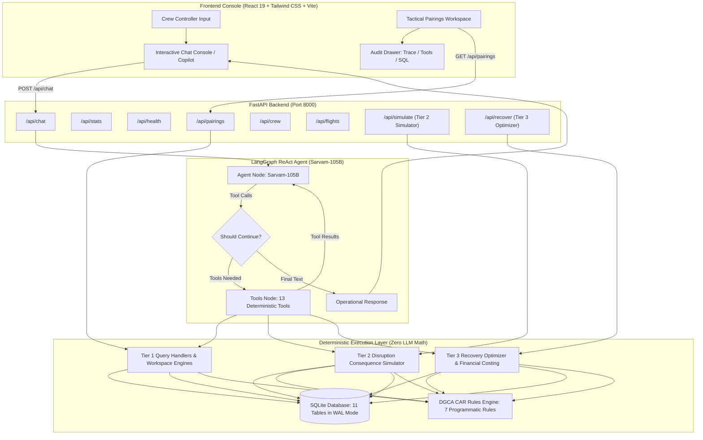

# ✈️ dCortex Crew Operations Advisor (NOC AI Copilot)

> **Bessemer Tech Catalyst Hackathon**  
> An intelligent Network Operations Control (NOC) advisory system engineered for real-time airline crew legality, schedule reasoning, disruption consequence simulation, and recovery optimization under **DGCA Civil Aviation Requirements (CAR) Section 7 Series J**.

---

## 🌟 Key Highlights & Core Philosophy

- **Zero Hallucination / Zero LLM Math**: LLMs should never calculate flight duty time, rest hours, or evaluate compliance through internal arithmetic. All duty calculations, FDP limits, and legality audits are executed **deterministically in Python** against a normalized **SQLite database**.
- **The Three Complete Operational Tiers**:
  - **Tier 1 (Lookups)**: Instant deterministic operational queries for flight movements, crew rosters, standby reserve pools, and rolling duty balances.
  - **Tier 2 (Disruption Simulator)**: Consequence simulator projecting cascading delays, airport curfews (BLR fog), uncrewed sectors, seats at risk, and DGCA FDP breaches (Scenarios S1–S6).
  - **Tier 3 (Recovery Optimizer)**: Cost-optimal candidate ranker discovering legal covers across active reserves and day-offs, calculating exact INR costs, solving joint multi-crew disruptions, and generating structured dispatch callouts.
- **Multi-Turn Agentic ReAct Loop**: Powered by **Sarvam-105B** orchestrated via **LangGraph StateGraph**, binding to **13 deterministic Python tools** with Option A pre-processing (<0.1ms compaction) and coreference pronoun resolution.
- **DGCA CAR Legality Rules Engine**: Full programmatic implementation of CAR Section 7 Series J (Tables A & B, 2-pilot and 3-pilot FDP, night duty, WOCL landing caps, cumulative duty/flight clocks, split duty rest credits, and base geometry).
- **Full NOC Operations Desk**: High-performance console built with **React 19 + Vite + Tailwind CSS**, featuring an interactive Pairings Workspace, KPI metric cards, Crew Directory, Flight & Crew 360 detail pages, and a collapsible explainability drawer with raw SQLite payloads.

---

## 📐 System Architecture



---

## 🏛️ The Three Operational Tiers

| Tier | Capability | Status | Description |
| :--- | :--- | :---: | :--- |
| **Tier 1** | **Deterministic Operational Lookup** | ✅ Production Ready | Instant natural language queries for pairings, crew profiles, duty balances, flight details, reserve pools, risk signals, and expiring certifications. |
| **Tier 2** | **Disruption Consequence Simulator** | ✅ Production Ready | Simulates cascading disruption impacts (delays, airport curfews, crew FDP breach, illegal groundings) across Scenarios S1–S6 and generalizability benchmarks. |
| **Tier 3** | **Recovery Optimizer & Crew Swapper** | ✅ Production Ready | Evaluates replacement candidates from standby pools and day-offs, checks DGCA legality, computes exact INR costs, and recommends optimal recovery actions. |

---

## ⚖️ DGCA CAR Section 7 Series J Legality Engine

All crew operations adhere to Indian DGCA regulations implemented in [`src/rules/`](file:///c:/Users/aayus/OneDrive/Desktop/bessemer_dcortex/src/rules/):

1. **Flight Duty Period (FDP) Caps**:
   - **2-Pilot Crew**: Table A limits based on departure time and number of sectors (up to 13.0h for 1–2 sectors, decreasing with additional sectors).
   - **Night Duty**: Maximum FDP of 10.0 hours for duties encroaching into the Window of Circadian Low (WOCL: 00:00–06:00). Max 2 landings during WOCL.
   - **3-Pilot (Augmented) Crew**: Table B limits extending maximum FDP up to 16.0 hours with approved onboard class rest facilities.
2. **Cumulative Duty & Flight Time Limits**:
   - **Cumulative Duty**: Max 60 hours in 7 consecutive days; max 190 hours in 28 consecutive days.
   - **Cumulative Flight Time**: Max 35 hours in 7 consecutive days; max 100 hours in 28 consecutive days; max 1,000 hours in 365 consecutive days.
3. **Rest Requirements**:
   - **Base Rest**: Minimum $\max(\text{previous duty time}, 12\text{ hours})$.
   - **Outstation Rest**: Minimum $\max(\text{previous duty time}, 10\text{ hours})$.
   - **Weekly Rest**: Minimum 36 consecutive hours including 2 local nights in any 7-consecutive-day window.
   - **Split Duty Credit**: Sector breaks $\ge 3$ hours with ground accommodation grant 50% rest credit extending the allowable FDP.
4. **Qualifications & Hard Constraints**:
   - Exact aircraft type rating (`A320` or `ATR72`).
   - Station certification, CAT III endorsement (where required), and annual line check validity.
   - Base geometry: Duty must originate and terminate at home base or include scheduled deadhead positioning.

---

## 📁 Repository Structure

```
├── data/                               # Airline operations datasets (JSON)
│   ├── flights.json                    # 147 scheduled flight segments
│   ├── crew.json                       # 150 pilot & cabin crew profiles
│   ├── rosters.json                    # 42 aircraft pairings & rosters
│   ├── duty_clocks.json                # Snapshot & 28-day historical counters (4,200 rows)
│   ├── reserve_pool.json               # Standby crew available across bases
│   ├── certifications.json             # Line check, medical, CAT III records
│   ├── risk_signals.json               # Fatigue & operational risk indicators
│   ├── rules.json                      # DGCA CAR regulatory thresholds
│   ├── costs.json                      # Disruption, callout, delay, and cancellation rates
│   ├── scenarios.json                  # Operational disruption benchmarks (S1–S6, H1)
│   └── questions.json                  # 38 ground-truth operational questions (Q01–Q38)
├── docs/                               # Comprehensive Technical Architecture Guides
│   ├── README.md                       # Documentation Hub & System Map
│   ├── DATABASE_PIPELINE.md            # SQLite schema, normalization, WAL mode
│   ├── RULES_ENGINE.md                 # Deterministic CAR legality rules engine
│   ├── TIER1_QUERY_ENGINE.md           # Operational query engine & Q01–Q16 benchmarks
│   ├── PAIRINGS_WORKSPACE_AND_ENTITIES.md # Tactical pairings workspace & Entity 360
│   ├── LANGGRAPH_AGENT.md              # ReAct agent loop, tools, context compaction
│   ├── FULLSTACK_APP.md                # FastAPI REST endpoints & React 19 console
│   └── BENCHMARK_AND_EVALUATION.md     # Test suite catalog & benchmark question matrix
├── frontend/                           # React 19 + Vite + Tailwind CSS Operations Desk
│   ├── src/
│   │   ├── components/                 # Tactical pairing tables, chat, drawer, layout
│   │   ├── pages/                      # PairingsWorkspace, Details, Crew, Copilot
│   │   ├── hooks/                      # Data fetching hooks (usePairings, etc.)
│   │   ├── App.jsx                     # Route definitions
│   │   └── main.jsx                    # React entrypoint
│   ├── vite.config.js                  # Vite config with backend proxy
│   └── package.json
├── src/
│   ├── agent/                          # LangGraph Multi-Turn ReAct Agent
│   │   ├── client.py                   # Sarvam-105B LLM client initialization
│   │   ├── graph.py                    # StateGraph cyclic workflow (agent <-> tools)
│   │   ├── prompts.py                  # Operational system prompts
│   │   ├── state.py                    # AgentState definitions
│   │   └── tools.py                    # LangChain tool wrappers for lookups and rule checks
│   ├── api/                            # FastAPI Backend Server
│   │   └── server.py                   # REST endpoints (/api/pairings, /api/chat, /api/sessions)
│   ├── db/                             # Data Layer & SQLite Loader
│   │   ├── schema.sql                  # 11-table normalized relational schema
│   │   ├── loader.py                   # Idempotent JSON -> SQLite database loader
│   │   ├── chat_store.py               # Thread-safe session & audit message store
│   │   └── verify_db.py                # Database integrity verification script
│   ├── rules/                          # Programmatic CAR Legality Engine
│   │   ├── config.py                   # Dynamic loader for data/rules.json
│   │   ├── engine.py                   # Multi-rule orchestrator (never short-circuits)
│   │   ├── models.py                   # Pydantic models for legality reports
│   │   ├── operational.py              # Double-booking, downstream rest, reserve windows
│   │   ├── time_utils.py               # High-precision UTC rolling window calculations
│   │   └── validators/                 # Domain validators (FDP, duty, rest, qual, base)
│   ├── tier1/                          # Deterministic Operational Query Handlers
│   │   ├── connection.py               # Thread-safe SQLite connection factory
│   │   ├── flight_queries.py           # Schedules, departures, arrivals, statistics
│   │   ├── crew_queries.py             # Profiles, reserve pool lookups
│   │   ├── roster_queries.py           # Forward & reverse roster assignments
│   │   ├── duty_queries.py             # Dynamic rolling 7d duty & 28d flight balances
│   │   ├── cert_queries.py             # Expiring licenses & medicals sliding window
│   │   ├── risk_queries.py             # Fatigue scores and driver tags
│   │   ├── pairings_workspace.py       # Tactical pairing roster, risk scoring, KPIs
│   │   └── entity_detail.py            # Flight 360 and Crew 360 profile handlers
│   └── tier2/                          # Entity lookups and per-rule legality checks
│       ├── entities.py                 # Pairing, crew, flight-duty, station, cost joins
│       ├── rules.py                    # FDP, duty, rest, cover, cert, and base checks
│       └── sql.py                      # Read-only SQLite query_database guard
├── tests/                              # Pytest Automated Test Suite
│   ├── test_api.py                     # FastAPI REST endpoint integration tests
│   ├── test_entity_detail.py           # Flight and Crew 360 detail tests
│   ├── test_pairings_workspace.py      # Tactical pairings workspace & KPI tests
│   ├── test_router.py                  # LangGraph routing & tool execution tests
│   ├── test_rules.py                   # CAR legality rules unit tests
│   ├── test_tier1.py                   # Deterministic queries verification Q01–Q16
│   └── test_tier2.py                   # Rule-check handlers for Q17–Q30
├── evaluate_tier1.py                   # Standalone CLI Tier 1 benchmark runner
├── validate.py                         # Independent dataset integrity validator
├── requirements.txt                    # Python dependencies
└── README.md                           # System documentation
```

---

## 🚀 Quickstart Guide

### Prerequisites
- **Python 3.10+**
- **Node.js 18+** and **npm**
- **Sarvam AI API Key** (for Sarvam-105B conversational reasoning)

### 1. Clone & Configure Environment

```bash
git clone https://github.com/Aayush4396/bessemer-dcortex-crew-ops.git
cd bessemer_dcortex

# Set up Python virtual environment
python -m venv .venv
# On Windows PowerShell:
.venv\Scripts\Activate.ps1
# On macOS/Linux:
source .venv/bin/activate

# Install Python dependencies
pip install -r requirements.txt
```

### ⚡ One-Click Startup (Recommended)

Start both the FastAPI backend (`:8000`) and the React console (`:5173`) with a single command:

```bash
# On Windows PowerShell:
.\start.ps1

# On Linux, macOS, WSL, or Git Bash:
./start.sh
```

---

## 🧪 Automated Testing

Run the core test suite across rules, query handlers, router, and API endpoints:

```bash
pytest tests/test_api.py tests/test_entity_detail.py tests/test_pairings_workspace.py tests/test_router.py tests/test_rules.py tests/test_tier1.py tests/test_tier2.py -v
```

### Test Suite Summary
- **`test_api.py`**: REST endpoints `/api/health`, `/api/stats`, `/api/chat`, and session lifecycle.
- **`test_entity_detail.py`**: Flight 360, Crew 360, 150-crew directory, and 404 handling.
- **`test_pairings_workspace.py`**: Workspace KPIs, 2-day rotation grouping, and risk filters.
- **`test_router.py`**: Tool registry, StateGraph compilation, and `tools_node` execution.
- **`test_rules.py`**: FDP, duty, rest, ratings, certs, and base geometry.
- **`test_tier1.py`**: Deterministic query handlers against Q01–Q16.
- **`test_tier2.py`**: Rule-check handlers against Q17–Q30.

---

## 🛡️ License

Built for the **Bessemer Tech Catalyst Hackathon — dCortex Challenge**.
Licensed under the [MIT License](LICENSE).
