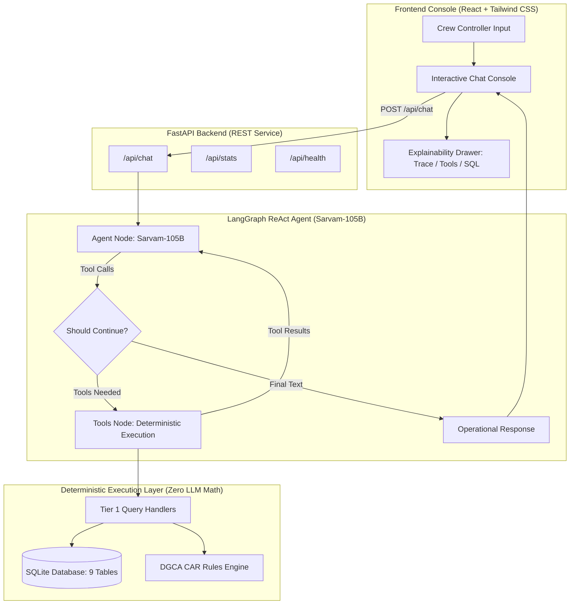

# ✈️ dCortex Crew Operations Advisor (NOC AI Copilot)

> **Bessemer Tech Catalyst Hackathon**  
> An intelligent Network Operations Control (NOC) advisory system engineered for real-time airline crew legality, schedule reasoning, disruption consequence simulation, and recovery optimization under **DGCA Civil Aviation Requirements (CAR) Section 7 Series J**.

---

## 🌟 Key Highlights & Core Philosophy

- **Zero Hallucination / Zero LLM Math**: LLMs should never calculate flight duty time, rest hours, or evaluate compliance through internal arithmetic. All duty calculations, FDP limits, and legality audits are executed **deterministically in Python** against a normalized **SQLite database**.
- **Multi-Turn Agentic ReAct Loop**: Powered by **Sarvam-105B** orchestrated via **LangGraph StateGraph**, supporting multi-hop cascading tool calls (e.g. roster lookup $\to$ crew profile discovery) with complete auditability.
- **DGCA CAR Legality Rules Engine**: Full programmatic implementation of CAR Section 7 Series J (Tables A & B, 2-pilot and 3-pilot FDP, night duty, WOCL landing caps, cumulative duty/flight clocks, split duty rest credits, and base geometry).
- **Full Operational Console**: High-performance glassmorphic UI built with **React 18 + Tailwind CSS + Vite**, featuring real-time fleet KPI metrics, interactive chat, and a collapsible explainability drawer detailing reasoning traces, tool dispatches, and raw SQLite payloads.

---

## 📐 System Architecture



---

## 🏛️ The Three Operational Tiers

| Tier | Capability | Status | Description |
| :--- | :--- | :---: | :--- |
| **Tier 1** | **Deterministic Operational Lookup** | ✅ Production Ready | Instant natural language queries for pairings, crew profiles, duty balances, flight details, reserve pools, risk signals, and expiring certifications. |
| **Tier 2** | **Disruption Consequence Simulator** | 🚧 Step 5 Foundation | Simulates cascading disruption impacts (delays, airport curfews, crew FDP breach, illegal groundings) across Scenarios S1–S6. |
| **Tier 3** | **Recovery Optimizer & Crew Swapper** | 🚧 Step 6 Foundation | Evaluates replacement candidates from standby pools, checks DGCA legality, and recommends cost-optimal recovery actions. |

---

## ⚖️ DGCA CAR Section 7 Series J Legality Engine

All crew operations adhere to Indian DGCA regulations implemented in `src/rules/`:

1. **Flight Duty Period (FDP) Caps**:
   - **2-Pilot Crew**: Table A limits based on departure time and number of sectors (up to 13.0h for 1 sector, decreasing with additional sectors).
   - **Night Duty**: Maximum FDP of 10.0 hours for duties encroaching into the Window of Circadian Low (WOCL: 00:00–06:00). Max 2 landings during WOCL.
   - **3-Pilot (Augmented) Crew**: Table B limits extending maximum FDP up to 16.0 hours with approved onboard class rest facilities.
2. **Cumulative Duty & Flight Time Limits**:
   - **Cumulative Duty**: Max 60 hours in 7 consecutive days; max 190 hours in 28 consecutive days.
   - **Cumulative Flight Time**: Max 35 hours in 7 consecutive days; max 100 hours in 28 consecutive days; max 1,000 hours in 365 consecutive days.
3. **Rest Requirements**:
   - **Base Rest**: Minimum $\max(\text{previous duty time}, 12\text{ hours})$.
   - **Outstation Rest**: Minimum $\max(\text{previous duty time}, 10\text{ hours})$.
   - **Weekly Rest**: Minimum 36 consecutive hours including 2 local nights in any 7-consecutive-day window.
   - **Split Duty Credit**: Sector breaks $\ge 3$ hours with ground accommodation grant 50% rest credit extending the allowable FDP.
4. **Qualifications & Hard Constraints**:
   - Exact aircraft type rating (`A320` or `ATR72`).
   - Station certification, CAT III endorsement (where required), and annual line check validity.
   - Base geometry: Duty must originate and terminate at home base or include scheduled deadhead positioning.

---

## 📁 Repository Structure

```
├── data/                       # Airline operations datasets (JSON)
│   ├── flights.json            # 147 scheduled flight segments
│   ├── crew.json               # 150 pilot & cabin crew profiles
│   ├── rosters.json            # 42 aircraft pairings & rosters
│   ├── duty_clocks.json        # 7-day, 28-day, 365-day cumulative counters
│   ├── reserve_pool.json       # Standby crew available across bases
│   ├── certifications.json     # Line check, medical, CAT III records
│   ├── risk_signals.json       # Fatigue & operational risk indicators
│   ├── rules.json              # DGCA CAR rule thresholds
│   └── costs.json              # Delay, overtime, and disruption rates
├── frontend/                   # React 18 + Tailwind CSS + Vite Console
│   ├── src/
│   │   ├── components/         # ChatConsole, MetricCard, AuditDrawer, Placeholders
│   │   ├── App.jsx             # NOC Dashboard layout & Tier navigation
│   │   └── main.jsx            # React root
│   ├── vite.config.js          # Vite config with backend proxy
│   └── package.json
├── src/
│   ├── agent/                  # LangGraph Multi-Turn ReAct Agent
│   │   ├── client.py           # Sarvam-105B LLM client initialization
│   │   ├── graph.py            # StateGraph cyclic workflow (agent <-> tools)
│   │   ├── prompts.py          # Strict operational system prompts
│   │   ├── state.py            # AgentState definitions
│   │   └── tools.py            # LangChain tool bindings
│   ├── api/                    # FastAPI Backend Server
│   │   └── server.py           # REST endpoints (/api/chat, /api/stats, /api/health)
│   ├── db/                     # Data Layer & SQLite Loader
│   │   ├── schema.sql          # 9-table normalized relational schema
│   │   └── loader.py           # Idempotent JSON -> SQLite database loader
│   ├── rules/                  # Programmatic CAR Legality Engine
│   │   ├── legality.py         # 10-point legality validation pipeline
│   │   ├── models.py           # Pydantic models for crew, flights, pairings
│   │   └── tables.py           # CAR Section 7 Series J Table A & B lookups
│   └── tier1/                  # Deterministic Operational Query Handlers
│       ├── connection.py       # Thread-safe SQLite connection factory
│       ├── queries.py          # Zero-hallucination query handlers (Q1–Q16)
│       └── tools.py            # Functional entrypoints for router
├── tests/                      # Pytest Automated Test Suite (37 Tests)
│   ├── test_api.py             # FastAPI endpoint integration tests
│   ├── test_router.py          # LangGraph routing & tool execution tests
│   ├── test_rules.py           # CAR legality rules unit tests
│   └── test_tier1.py           # Deterministic queries verification (Q1–Q16)
├── requirements.txt            # Python dependencies
└── README.md                   # System documentation
```

---

## 🚀 Quickstart Guide

### Prerequisites
- **Python 3.10+**
- **Node.js 18+** and **npm**
- **Sarvam AI API Key** (for Sarvam-105B model reasoning)

### 1. Clone & Configure Environment

```bash
git clone https://github.com/Aayush4396/bessemer-dcortex-crew-ops.git
cd bessemer_dcortex

# Set up Python virtual environment
python -m venv .venv
# On Windows PowerShell:
.venv\Scripts\Activate.ps1
# On macOS/Linux:
source .venv/bin/activate

# Install Python dependencies
pip install -r requirements.txt
```

Create a `.env` file in the project root:
```env
SARVAM_API_KEY=your_sarvam_api_key_here
SARVAM_MODEL=sarvam-105b
DB_PATH=crew_ops.db
```

### 2. Initialize SQLite Database

Populate the local `crew_ops.db` file from the dataset JSON files:
```bash
python -m src.db.loader
```

### 3. Start FastAPI Backend

```bash
uvicorn src.api.server:app --host 127.0.0.1 --port 8000 --reload
```
The API is live at `http://127.0.0.1:8000`. Test health:
```bash
curl http://127.0.0.1:8000/api/health
```

### 4. Start React Operations Console

In a new terminal window:
```bash
cd frontend
npm install
npm run dev
```
Open your browser at **`http://127.0.0.1:5173`** to access the NOC AI Copilot console.

---

## 🧪 Automated Testing

Run the full test suite across rules, query handlers, LangGraph routing, and API endpoints:

```bash
pytest tests/ -v
```

### Test Suite Summary (37 / 37 Passing)
- **`test_rules.py`**: Validates FDP Table A & B bounds, night duty caps, 7-day/28-day cumulative duty limits, base vs. outstation rest rules, weekly rest, and base geometry.
- **`test_tier1.py`**: Validates deterministic query handlers against the benchmark test cases (Q1–Q16).
- **`test_router.py`**: Verifies tool registry mapping, StateGraph compilation, and multi-turn ReAct decision logic.
- **`test_api.py`**: Verifies REST endpoints `/api/health`, `/api/stats`, `/api/chat`, and error handling.

---

## 💬 Sample Inquiries to Try in the Console

- **Reserves Lookup**: *"Who is on reserve at BLR on 2026-09-15?"*
- **Duty Balance**: *"What is C-1042's 7-day duty balance and 28-day flight hours?"*
- **Flight Schedule**: *"Show all flights departing from DEL on 2026-09-15."*
- **Certifications**: *"Which crew members have certifications expiring within 15 days?"*
- **Aircraft Details**: *"Give me the details of flight DX412 including aircraft and route."*
- **Pairing Roster**: *"Who is the Senior Cabin Crew on VT-DXB's pairing on 2026-09-16?"*
- **Risk Signals**: *"Does crew member C-1042 have any active fatigue or risk signals?"*

---

## 🛡️ License

Built for the **Bessemer Tech Catalyst Hackathon — dCortex Challenge**.
Licensed under the [MIT License](LICENSE).
