# dCortex Crew Operations Advisor Architecture

This document describes the current end-to-end architecture of the dCortex Crew Operations Advisor: data ingestion, SQLite storage, deterministic query and legality logic, resolver flows, LangGraph orchestration, FastAPI APIs, React UI, and evaluation.

## Quick Navigation

1. [System purpose and architecture](#1-system-purpose)
2. [Source data and ingestion](#3-source-data-and-ingestion)
3. [Relational data model](#4-relational-data-model)
4. [Startup and request flow](#5-application-startup)
5. [Tier 1 deterministic queries](#7-tier-1-deterministic-query-layer)
6. [Time calculations and legality](#8-time-and-duty-calculations)
7. [Tier 2 disruption analysis](#10-tier-2-disruption-analysis)
8. [Tier 3 recovery and costing](#11-tier-3-recovery-and-costing)
9. [Agent, API, UI, and evaluation](#12-agent-tool-registry)
10. [Current boundaries and next work](#16-next-integration-work)
11. [Rubric alignment and honest limitations](#17-rubric-alignment-and-honest-limitations)

## 1. System Purpose

The application is a NOC copilot for a fictional airline operating from a BLR hub. It answers crew-control questions using a frozen synthetic operational snapshot:

- Snapshot: `2026-09-14T18:00:00Z`
- Planned operations: `2026-09-15` through `2026-09-20`
- Fleet: A320 and ATR72
- Dataset: 147 flights, 150 crew, 39 pairings, 16 reserves
- Time convention: UTC; rolling duty windows use inclusive calendar dates

The core design rule is that the LLM does not calculate operational values. It identifies the required operation and formats verified results. Python and SQLite perform lookups, time arithmetic, legality checks, disruption analysis, and recovery costing.

### Abstract flow

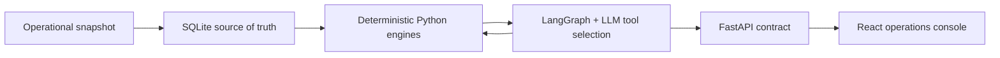

Read the diagram from left to right for data and from the center outward for a user request: the LLM selects an operation, deterministic code executes it, and the verified result returns through the API to the console.

## 2. High-Level Architecture

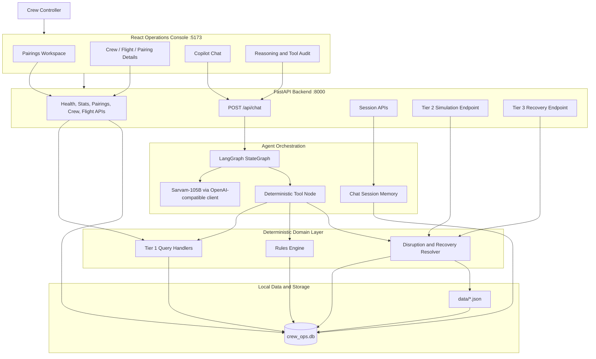

### Current implementation boundary

The deterministic resolver and agent tools for Tier 2 and Tier 3 are implemented. Tier 2 and Tier 3 are accessed through `POST /api/chat` and the LangGraph tool loop; there are no separate simulation or recovery REST routes.

## 3. Source Data and Ingestion

The `data/` directory is the source snapshot. `src/db/loader.py` applies `src/db/schema.sql`, transforms nested JSON structures, and loads an idempotent SQLite database.

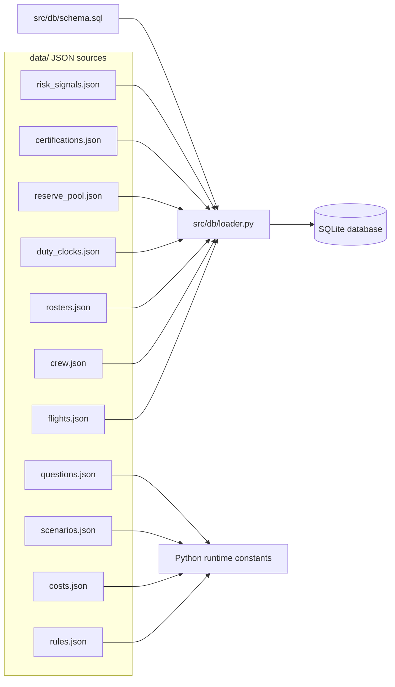

### JSON-to-SQLite transformations

| JSON source | SQLite destination | Transformation |
|---|---|---|
| `flights.json` | `flights` | One row per flight leg |
| `crew.json` | `crew` | `ratings` array serialized as JSON text |
| `rosters.json` | `pairings`, `pairing_crew` | Pairing days and crew assignments are decomposed into relational records |
| `duty_clocks.json` | `duty_clocks`, `duty_clock_history` | Snapshot totals are separated from 28 daily history rows |
| `reserve_pool.json` | `reserve_pool` | Nested dates are expanded to one row per crew/date |
| `certifications.json` | `certifications` | One row per crew/certification type |
| `risk_signals.json` | `risk_signals` | `drivers` array serialized as JSON text |
| `rules.json` | Python configuration | Loaded by `src/rules/config.py`; not stored in SQLite |
| `costs.json` | Resolver runtime configuration | Loaded by `src/resolver/data.py`; not stored in SQLite |
| `scenarios.json`, `questions.json` | Evaluation/runtime fixtures | Used by evaluators and scenario specifications |

The loader enables SQLite WAL mode, foreign keys, indexes, and `sqlite3.Row` results. The default application database is `crew_ops.db`; tests and evaluators normally use an in-memory database.

## 4. Relational Data Model

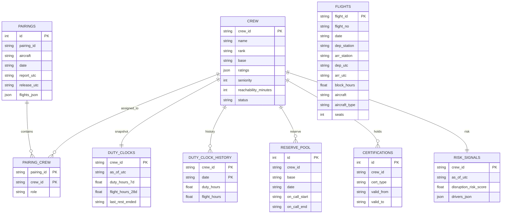

`rosters.json` is the source roster model. SQLite has no table named `rosters`; a roster is reconstructed by joining `pairings` with `pairing_crew`. The `flagged_exceptions` array in `rosters.json` remains source metadata and is not loaded as a separate table.

Chat persistence adds `chat_sessions` and `chat_messages` at runtime through `src/db/chat_store.py`. These store conversational turns, tool calls, tool results, and reasoning traces for auditability.

## 5. Application Startup

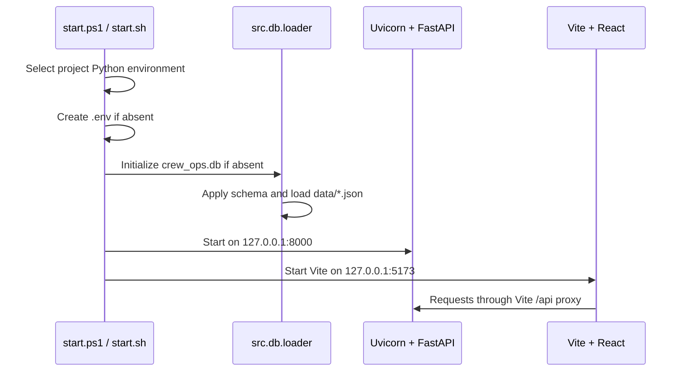

## 6. Chat Request Flow

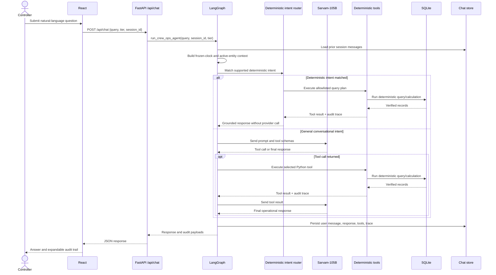

The graph has three nodes:

1. `deterministic_router`: recognizes supported direct operational intents and executes an allowlisted query plan without external model dependency.
2. `agent`: invokes the LLM with all registered tool schemas for queries not handled by the deterministic router.
3. `tools`: executes LLM-requested tools and appends `ToolMessage` results.

The conditional edge loops back to `agent` when tool calls exist and ends after a final response. A six-tool-call safety limit prevents runaway loops. Historical tool payloads are compacted before later turns, while active aviation entities such as crew, flight, aircraft, and pairing IDs are retained for pronoun resolution.

The LLM is therefore responsible for intent interpretation, parameter selection, and response wording. It is not trusted for database facts or arithmetic.

## 7. Tier 1 Deterministic Query Layer

Tier 1 handlers live in `src/tier1/`. Each handler accepts explicit parameters, obtains a thread-safe SQLite connection, executes parameterized SQL, and returns JSON-compatible dictionaries/lists.

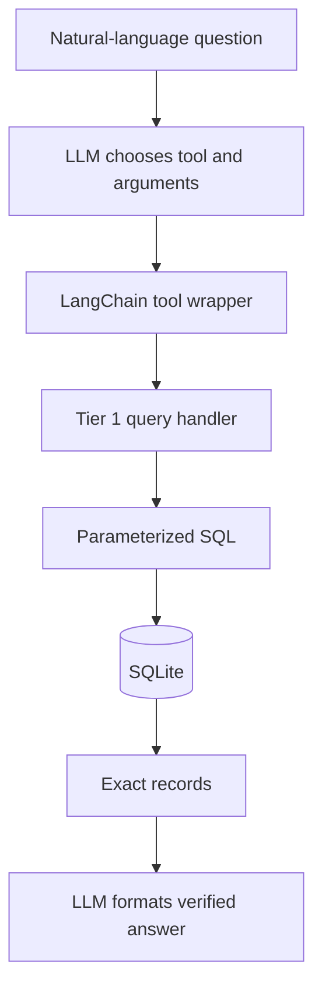

Available lookup capabilities:

- Flight schedule, route, aircraft, seat, count, and distinct destinations
- Station departures and arrivals
- Longest/shortest block-time statistics
- Crew profile, rank, base, rating, status, reserve window, and reachability
- Reserve availability by station/date/rank
- Pairing roster and reverse crew schedule lookup
- Duty and flight-hour balance
- Expiring certifications
- Precomputed risk signals

Tier 1 benchmark coverage is `Q01`–`Q16`. `evaluate_tier1.py` independently executes all 16 deterministic benchmark paths.

## 8. Time and Duty Calculations

All timestamps are parsed as UTC strings using `src/rules/time_utils.py` and resolver equivalents.

### Duty period / FDP

For a duty day:

```text
report = first departure - 60 minutes
release = last arrival + 30 minutes
FDP hours = release - report
```

For example, if the first departure is `02:00Z` and the last arrival is `12:15Z`:

```text
report  = 01:00Z
release = 12:45Z
FDP     = 11.75 hours
```

### FDP limit

`RULE-FDP-01` is read from `data/rules.json`:

```text
limit = base_fdp_hours - reduction_per_extra_sector_hours
        * max(0, sectors - free_sectors)
```

With the current parameters:

| Sectors | Limit |
|---:|---:|
| 1–2 | 13.0h |
| 3 | 12.5h |
| 4 | 12.0h |
| 5 | 11.5h |

### Rolling windows

The rolling window is calendar-day based and inclusive:

```text
window_start = window_end - (window_days - 1)
```

For `RULE-DUTY-02`:

```text
duty_7d = SUM(duty_clock_history.duty_hours in window)
          + planned pairing duty hours in window
          + simulated cover duty hours in window

legal if duty_7d <= 60.0h
headroom = 60.0h - duty_7d
```

For `RULE-FLT-03`, the same process sums flight block hours over 28 calendar days and checks the 100-hour cap.

The engine combines historical rows, future published pairing rows, and prior days of a simulated multi-day cover. When swapping a crew member, the replaced pairing is excluded before adding the proposed cover.

### Rest

`RULE-REST-04` checks both directions:

```text
upstream rest   = proposed report - previous release
downstream rest = next scheduled report - proposed release
```

The assignment is legal only when each applicable rest interval is at least 12 hours. Multi-day pairings pass the prior day release into the next day evaluation.

## 9. Legality Engine

`src/rules/engine.py` is the centralized legality orchestrator. It fetches the crew record, rejects non-active crew, evaluates all configured rules, and returns a structured legality report.

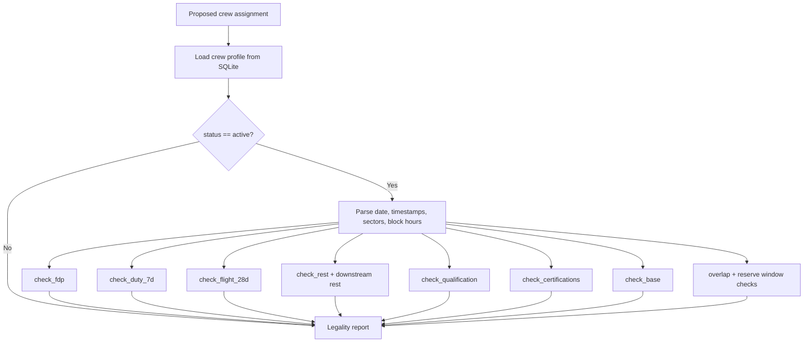

The seven configured rules are:

| Rule | Deterministic check | Result |
|---|---|---|
| `RULE-FDP-01` | Daily FDP against sector-based cap | Violation if over limit |
| `RULE-DUTY-02` | 7-day calendar duty sum ≤ 60h | Violation if exceeded |
| `RULE-FLT-03` | 28-day block-hour sum ≤ 100h | Violation if exceeded |
| `RULE-REST-04` | Upstream/downstream rest ≥ 12h | Violation if insufficient |
| `RULE-QUAL-05` | Assigned aircraft type in crew ratings | Violation if absent |
| `RULE-CERT-06` | Every certification `valid_to` covers duty date | Violation if expired |
| `RULE-BASE-07` | Base matches departure station | Advisory when positioning/deadhead is required |

Operational constraints add double-booking and reserve-window checks. The engine does not short-circuit the rule list, allowing the audit response to show all discovered violations.

`check_crew_legality_for_pairing` evaluates each day in chronological order, carries forward prior cover duty and release time, and treats the overnight station as the departure point on later days of a multi-day pairing.

## 10. Tier 2 Disruption Analysis

Tier 2 resolver functions are in `src/resolver/disruption.py` and are exposed to the agent through `src/agent/tools.py`.

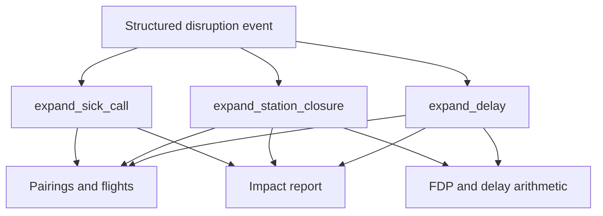

Current deterministic operations:

- `expand_sick_call`: finds the affected pairing, lists day-one/day-two uncovered flights, and sums seats for passengers at risk.
- `expand_station_closure`: finds flights departing from or arriving at a station during the closure window, calculates minimum delay, recalculates crew FDP, and recommends delay, re-crew, or cancellation.
- `expand_delay`: shifts a pairing FDP by the technical delay and compares it against the sector-based FDP cap.
- `compute_duty_window`: calculates historical plus planned duty/flight hours for an arbitrary calendar window.

These functions use read-only base data and calculate results in memory. They do not modify the published roster or SQLite snapshot.

## 11. Tier 3 Recovery and Costing

Recovery logic is in `src/resolver/cover.py`. It follows the candidate rules encoded by `generate.py` and validated by `evaluate_tier2_tier3.py`.

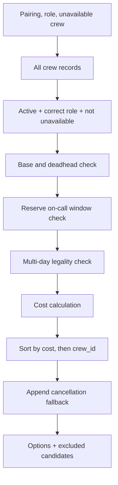

### Candidate filtering

For every candidate, the resolver checks:

1. Crew status is `active`.
2. Rank matches the required role.
3. Aircraft type is present in `ratings`.
4. Existing pairing is excluded when evaluating a swap.
5. Schedule overlap is absent.
6. Upstream and downstream rest are legal.
7. 7-day duty and 28-day flight limits remain legal.
8. All certifications are valid on every covered duty date.
9. Reserve window covers the required report time.
10. Cross-base positioning is available when needed.

Rejected candidates are retained with rule-oriented reasons such as `RULE-QUAL-05`, `RULE-DUTY-02`, `RULE-REST-04`, or `RULE-BASE-07`.

### Deadhead calculation

The synthetic dataset supports DEL-to-BLR positioning only:

- Odd dates use `DX402`, arriving at `08:45Z`.
- Even dates use `DX589`, arriving at `07:45Z`.
- The positioned crew requires 15 minutes transit, then the normal 60-minute report buffer.
- The resulting first-departure delay is charged to the recovery cost.

Other cross-base directions are excluded because no same-day positioning flight exists.

### Cost calculation

```text
reserve candidate = reserve callout fee
day-off candidate = day-off callout fee
deadhead candidate += positioning fee
deadhead candidate += delay_hours * delay_cost_per_duty_hour
cancellation = cancellation_per_flight * number_of_legs
```

Options are sorted by `(cost_inr, crew_id)`. Cancellation is appended after crew options as the fallback. The current implementation supports single-pairing candidate ranking; joint simultaneous assignment is assembled in the Tier 3 evaluator for the existing S6 benchmark rather than exposed as a dedicated resolver service.

## 12. Agent Tool Registry

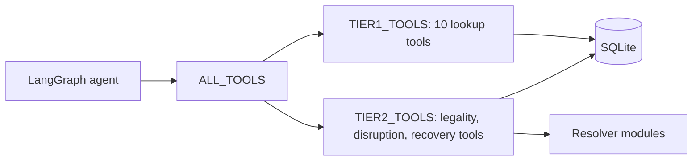

Current tool groups:

- Tier 1: 11 schedule, crew, reserve, roster, duty, certification, risk, and generalized query tools.
- Tier 2/3 group: `check_crew_cover_legality`, `get_cover_options`, `analyze_sick_call`, `analyze_station_closure`, `analyze_delay_impact`, and `compute_duty_window`.
- Generalized queries: `query_operations` supports allowlisted resources, filters, fields, sorting, limits, thresholds, counts, distinct values, and numeric aggregations.

The agent currently binds `ALL_TOOLS`. The `tier` request value is returned and persisted, but tool availability is not yet isolated into separate Tier 1, Tier 2, and Tier 3 registries.

## 13. REST and Frontend Flow

### Backend endpoints

| Endpoint | Current behavior |
|---|---|
| `GET /api/health` | Service status and frozen snapshot date |
| `GET /api/stats` | Flight, crew, pairing, reserve, station, and fleet metrics |
| `GET /api/pairings` | Pairings workspace data with date/aircraft/risk filters |
| `GET /api/pairings/{pairing_id}` | Pairing detail |
| `GET /api/flights/{flight_id}` | Flight detail |
| `GET /api/crew` | Crew list with rank/base/risk filters |
| `GET /api/crew/{crew_id}` | Crew detail |
| `POST /api/chat` | LangGraph chat request with audit payload |
| `GET/POST/DELETE /api/sessions...` | Persistent chat sessions and history |

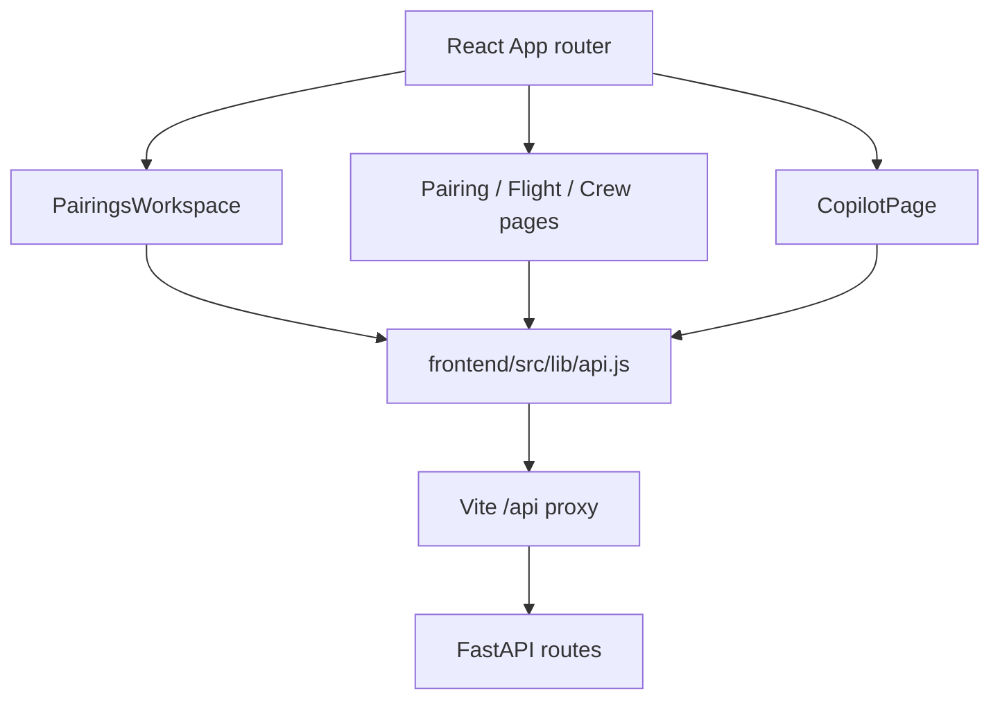

The UI displays deterministic records directly for workspace/detail views. Chat responses include `response`, `tool_calls`, `tool_results`, `reasoning_trace`, `tier`, and `session_id`; the copilot renders the answer and exposes the audit trail.

## 14. Evaluation and Verification

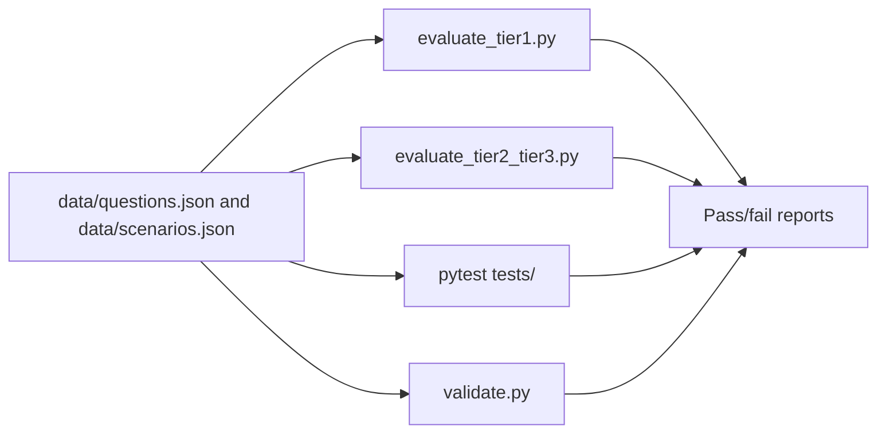

Current verified results:

- Tier 1 evaluator: `Q01`–`Q16`, 16/16 passed.
- Tier 2/3 evaluator: 19/19 testable questions passed; Q30, Q36, and Q38 are rubric-graded skips.
- Scenario evaluator: S1–S6, 6/6 passed.
- Dataset validator: internally consistent.
- The local `.venv/bin/python.exe` environment currently lacks `pytest`; the evaluator scripts run successfully without pytest.

The benchmark fixtures are the grading specification. In particular, `generate.py` defines the expected candidate enumeration and costing semantics; the broader regulatory descriptions in `README.md` should not be treated as implemented behavior when they differ from `data/rules.json` and the answer keys.

## 15. Operational Invariants

The following invariants should be preserved when extending the system:

1. Never allow the LLM to calculate hours, costs, limits, or passenger counts.
2. Treat SQLite and the JSON dataset as the immutable base snapshot.
3. Apply disruptions in memory; do not mutate the published roster for a simulation.
4. Evaluate every applicable legality rule and preserve exact rule IDs in audit output.
5. Use UTC timestamps and inclusive calendar-day windows.
6. Evaluate every day of a multi-day pairing, including downstream rest effects.
7. Keep legal options and excluded candidates in the recovery response.
8. Preserve deterministic ordering and cost tie-breaks.
9. Keep scenario answer keys independent; scenarios do not chain state.
10. Expose tool arguments, raw results, and reasoning traces for explainability.

## 16. Next Integration Work

The remaining work to make the architecture fully end to end is concentrated at the chat and frontend boundary:

1. Add explicit tier selection to the frontend copilot.
2. Add a dedicated joint optimizer for simultaneous absences.
3. Connect frontend recovery/simulation screens to `/api/chat` with structured prompts or dedicated chat actions.
4. Add API integration tests for resolver tool dispatch and scenario payloads.

## 17. Rubric Alignment and Honest Limitations

This section maps the implementation to the expected prototype deliverables and makes the LLM/deterministic boundary explicit.

### 17.1 Reasoning boundary

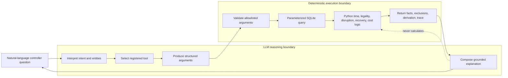

The deterministic router handles recognized direct query plans before the LLM boundary. For remaining questions, the model is an orchestrator and narrator, not the source of truth. Tool schemas constrain the request; the service layer constrains resources, fields, operators, and limits; SQLite and Python produce the operational result.

### 17.2 Natural-language request path

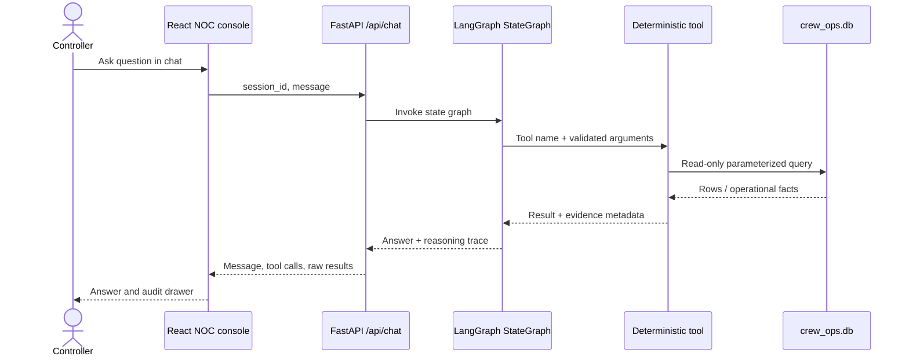

### 17.3 Explainability path

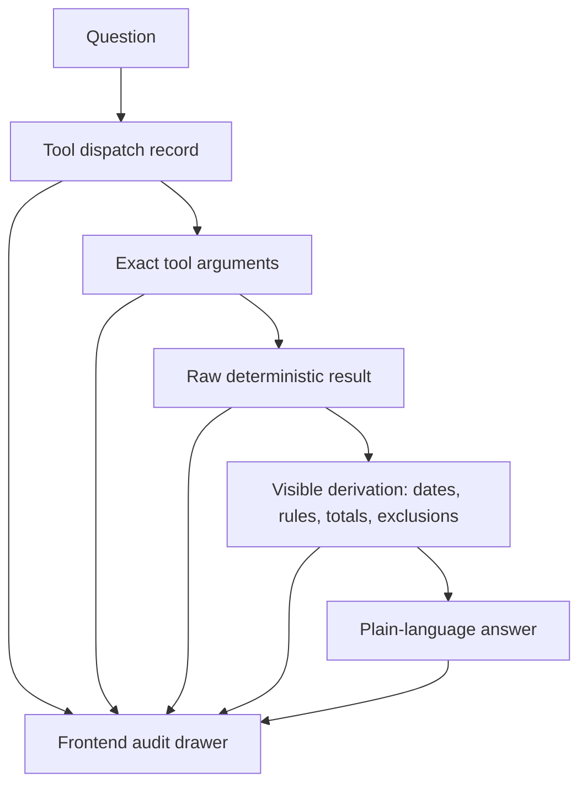

Every non-trivial answer should expose enough of this chain for a controller to distinguish database facts from computed conclusions. A missing credential or unavailable model is an operational failure, not a reason to invent an answer.

### 17.4 Grounding and data boundary

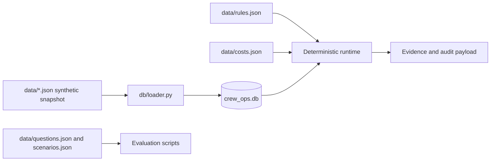

The runtime reads operational entities from SQLite. JSON files are ingestion/configuration/evaluation inputs; they are not an alternate live query source. The published snapshot remains synthetic and local.

### 17.5 Coverage by tier

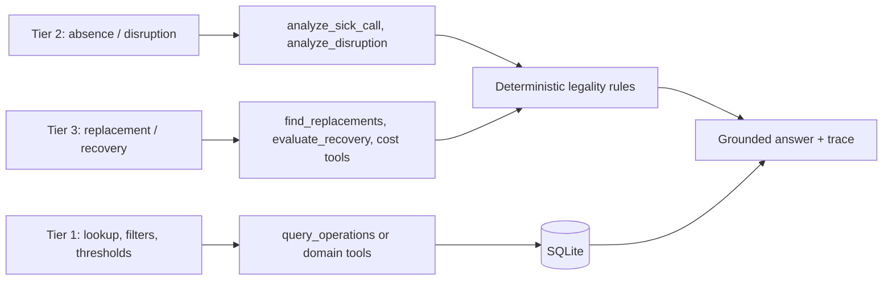

Examples: “all crew below 60 duty hours” uses `query_operations`; a sick-call question enumerates affected pairing legs; a recovery question ranks legal candidates and reports excluded candidates and costs. All three remain reachable through the same `/api/chat` LangGraph path.

### 17.6 Honest failure case

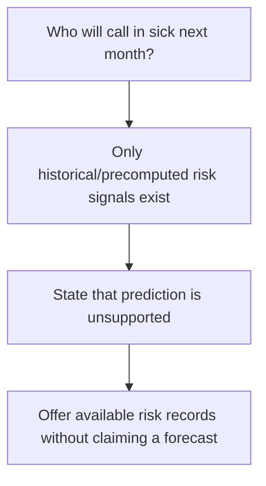

The system must not turn a risk signal into a prediction. Other current limitations are voice input, a dedicated joint optimizer for simultaneous absences, and model-dependent tool selection when the Sarvam endpoint is unavailable. Unsupported filters or calculations should produce an explicit limitation rather than a guessed result.

### 17.7 Live demo and presentation flow

```mermaid
flowchart LR
    Start[Start backend + frontend] --> Health[Verify /health]
    Health --> Lookup[Ask a Tier 1 roster/flight question]
    Lookup --> Audit[Open visible tool/evidence trace]
    Audit --> Disruption[Ask Tier 2 sick-call question]
    Disruption --> Recovery[Ask Tier 3 replacement/cost question]
    Recovery --> Failure[Show unsupported prediction example]
    Failure --> Close[Explain trade-offs and limitations]
```

The README, this architecture document, evaluator scripts, and the frontend together provide the setup, conversational interface, deterministic reasoning layer, explanation surface, sample flows, and honest failure analysis required for the prototype demonstration.
