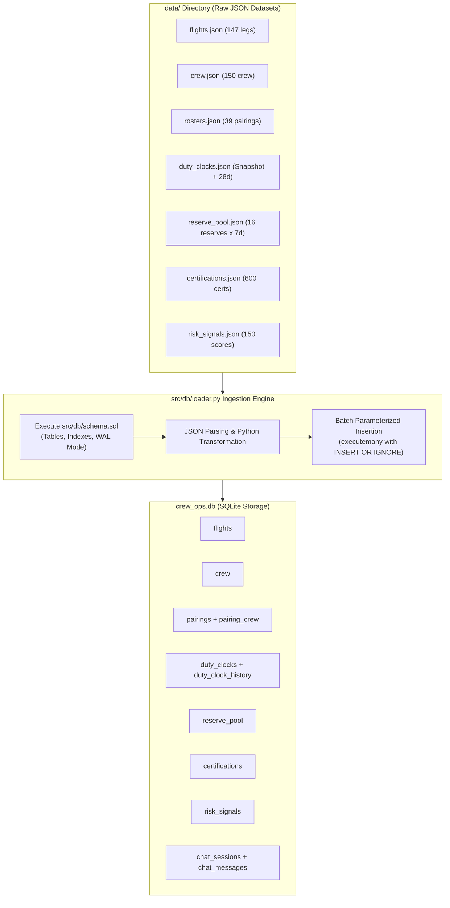
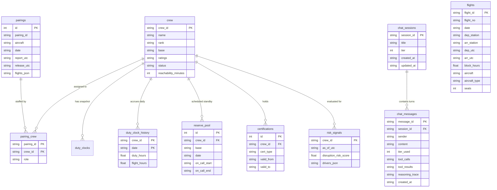

# SQLite Database Ingestion Pipeline & Architecture

This document details the end-to-end data pipeline for the **dCortex Crew Operations Advisor**: how raw operational JSON datasets are normalized, transformed, indexed, and ingested into SQLite (`crew_ops.db`).

---

## 1. Overview & Ingestion Flow



---

## 2. Dataset Breakdown: What Goes Where

| Source File | Destination Table(s) | Transformation / Normalization Applied | Row Count |
|:---|:---|:---|:---|
| [`data/flights.json`](file:///c:/Users/aayus/OneDrive/Desktop/bessemer_dcortex/data/flights.json) | `flights` | Direct mapping of flight schedules across 8 stations and 6 aircraft. | 147 rows |
| [`data/crew.json`](file:///c:/Users/aayus/OneDrive/Desktop/bessemer_dcortex/data/crew.json) | `crew` | `ratings` array serialized to JSON string (`'["A320"]'`). Status constrained to `('active','leave','training')`. | 150 rows |
| [`data/rosters.json`](file:///c:/Users/aayus/OneDrive/Desktop/bessemer_dcortex/data/rosters.json) | `pairings` | **Decomposed into two relational tables:**<br>1. `pairings`: 1 row per pairing-day, storing report/release UTC and flight list as JSON string.<br>2. `pairing_crew`: Junction table mapping crew member to pairing role. | 42 pairing-days<br>39 distinct pairings |
| [`data/duty_clocks.json`](file:///c:/Users/aayus/OneDrive/Desktop/bessemer_dcortex/data/duty_clocks.json) | `duty_clocks`<br>`duty_clock_history` | **Decomposed into snapshot vs historical:**<br>1. `duty_clocks`: Snapshot totals as of 2026-09-14T18:00:00Z.<br>2. `duty_clock_history`: 28 individual daily rows per crew for rolling-window calculations (`SUM(duty_hours)`). | 150 snapshot rows<br>4,200 history rows |
| [`data/reserve_pool.json`](file:///c:/Users/aayus/OneDrive/Desktop/bessemer_dcortex/data/reserve_pool.json) | `reserve_pool` | Unpacked nested dates array into individual `(crew_id, base, date, on_call_start, on_call_end)` records. | 112 rows (16 crew × 7 dates) |
| [`data/certifications.json`](file:///c:/Users/aayus/OneDrive/Desktop/bessemer_dcortex/data/certifications.json) | `certifications` | 4 certification types per crew (`licence`, `medical_class1`, `recurrent_training`, `dangerous_goods`). | 600 rows |
| [`data/risk_signals.json`](file:///c:/Users/aayus/OneDrive/Desktop/bessemer_dcortex/data/risk_signals.json) | `risk_signals` | `drivers` array serialized to JSON string (`drivers_json`). | 150 rows |
| **Runtime Activity** | `chat_sessions`<br>`chat_messages` | Managed by [`src/db/chat_store.py`](file:///c:/Users/aayus/OneDrive/Desktop/bessemer_dcortex/src/db/chat_store.py) for conversational memory and complete compliance audit logs. | Dynamic |

> [!NOTE]
> **Static Files Not in SQLite**:
> - `rules.json` (7 DGCA CAR Section 7 rules) and `costs.json` (9 financial recovery constants) remain in memory as fast Python constants (`src/rules/models.py`) because they are immutable domain specifications.

---

## 3. SQLite Relational Schema & ERD (`src/db/schema.sql`)

The database uses SQLite 3 with performance and concurrency pragmas:

```sql
PRAGMA journal_mode = WAL;
PRAGMA foreign_keys = ON;
```

### Entity-Relationship Diagram (ERD)



### Key Indices for Sub-Millisecond Queries:
- `idx_flights_dep_station`: Fast station departure lookups: `(dep_station, date)`.
- `idx_flights_aircraft`: Instant aircraft schedule lookups: `(aircraft)`.
- `idx_pairings_pid_date`: Unique index on pairing identifier and date: `(pairing_id, date)`.
- `idx_dch_date`: Accelerated rolling window queries over 4,200 history rows: `(date)`.
- `idx_cert_valid_to`: Instant validity queries for expiring certifications: `(valid_to)`.
- `idx_cs_updated_at`: Fast session list sorting: `(updated_at DESC)`.
- `idx_cm_session_created`: Instant session message reconstruction: `(session_id, created_at ASC)`.

---

## 4. The Ingestion Engine (`src/db/loader.py`)

The loader pipeline is executed via `init_db(data_dir, db_path)`:

```python
conn = sqlite3.connect(db_path, check_same_thread=False)
conn.row_factory = sqlite3.Row
conn.execute("PRAGMA journal_mode = WAL")
conn.execute("PRAGMA foreign_keys = ON")

_apply_schema(conn)
_load_flights(conn, data_dir / "flights.json")
_load_crew(conn, data_dir / "crew.json")
_load_rosters(conn, data_dir / "rosters.json")
_load_duty_clocks(conn, data_dir / "duty_clocks.json")
_load_reserve_pool(conn, data_dir / "reserve_pool.json")
_load_certifications(conn, data_dir / "certifications.json")
_load_risk_signals(conn, data_dir / "risk_signals.json")
conn.commit()
```

### Key Engineering Patterns in `loader.py`:
1. **Idempotent Inserts**: Every query uses `INSERT OR IGNORE`. Re-running the loader never duplicates data or violates primary key constraints.
2. **Batch Parameterized Binding**: Utilizes `executemany` with named parameter dictionaries (e.g. `:crew_id`, `:flight_no`). This avoids SQL string concatenation, prevents syntax errors, and completes ingestion in $<100\text{ ms}$.
3. **Data Normalization in Python**:
   - `_load_rosters`: Traverses each pairing, generating one record per operational day in `pairings` while creating normalized crew assignments in `pairing_crew`.
   - `_load_duty_clocks`: Separates static `as_of_utc` totals from the 28 daily history records (`duty_clock_history`).

---

## 5. How to Re-Run / Rebuild the Database

### Command-Line Execution
To rebuild the database or run a smoke test:
```powershell
# Rebuild in-memory or on-disk
.venv\Scripts\python.exe -m src.db.loader
```

Output:
```
Loading data into in-memory SQLite...

Row counts:
  flights                      147 rows
  crew                         150 rows
  pairings                      42 rows
  pairing_crew                 156 rows
  duty_clocks                  150 rows
  duty_clock_history          4200 rows
  reserve_pool                 112 rows
  certifications               600 rows
  risk_signals                 150 rows

Done — SQLite loaded successfully.
```

### Automated Verification Script
Run the automated cross-check to verify ground truth parity against `questions.json`:
```powershell
.venv\Scripts\python.exe -m src.db.verify_db
```
Verifies table counts, foreign keys, and known regulatory answers (e.g., Captain C-1042 duty headroom, BLR reserve pool members).
