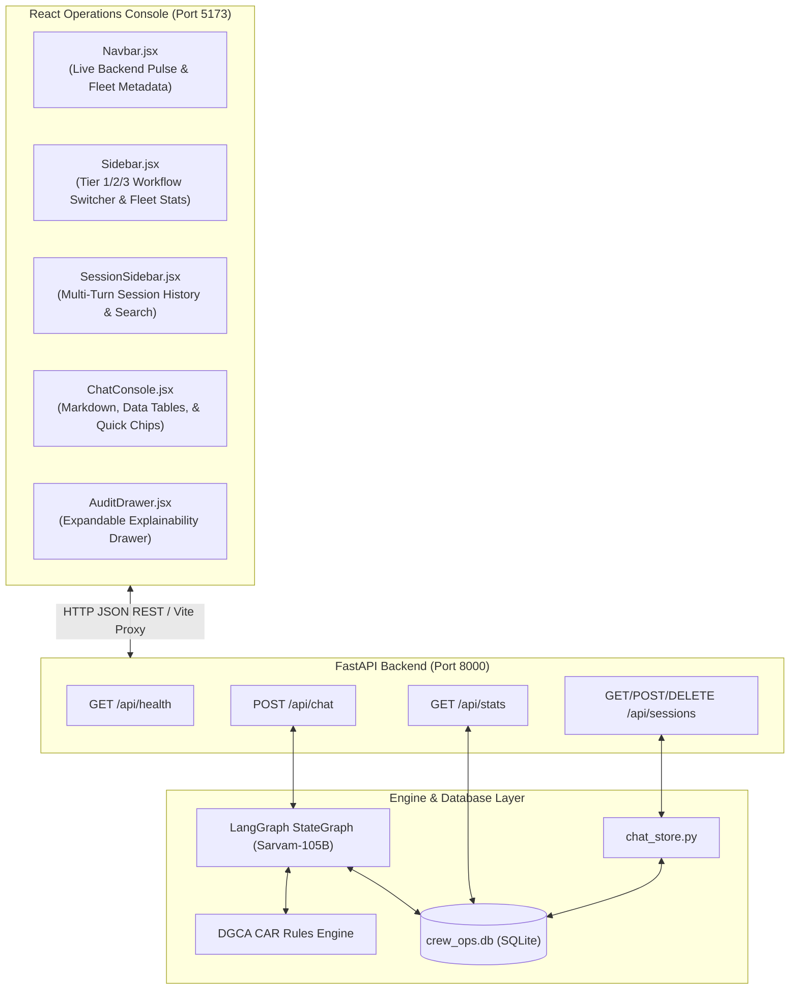
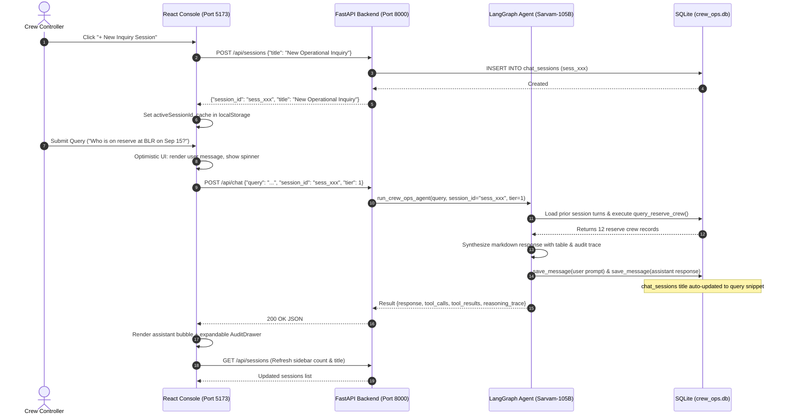

# Full-Stack Application Architecture: FastAPI & React Console

This document details the **Full-Stack Application Layer** of the **dCortex Crew Operations Advisor**:
- **Backend API Layer:** FastAPI server in [`src/api/server.py`](file:///c:/Users/aayus/OneDrive/Desktop/bessemer_dcortex/src/api/server.py).
- **Frontend Console:** React + Vite + Tailwind CSS NOC Operations Desk in [`frontend/`](file:///c:/Users/aayus/OneDrive/Desktop/bessemer_dcortex/frontend/).

---

## 1. System Architecture & End-to-End Flow



### End-to-End Operational Interaction Sequence



---

## 2. FastAPI Backend Layer ([src/api/server.py](file:///c:/Users/aayus/OneDrive/Desktop/bessemer_dcortex/src/api/server.py))

The backend exposes a high-performance REST API built with FastAPI and Pydantic:

### API Endpoints Catalog

| Method | Route | Description | Request Body | Response Model |
|:---|:---|:---|:---|:---|
| `GET` | `/api/health` | Health check endpoint returning backend status and snapshot date. | None | `{"status": "healthy", "service": "...", "snapshot_date": "2026-09-14"}` |
| `GET` | `/api/stats` | Fetches live counts (flights, crew, pairings, reserves) and active stations. | None | `StatsResponse` |
| `POST` | `/api/chat` | Dispatches natural language operational query through LangGraph with session memory. | `ChatRequest`<br>`{"query": "...", "session_id": "...", "tier": 1}` | `ChatResponse`<br>`{"response": "...", "tool_calls": [...], "session_id": "..."}` |
| `GET` | `/api/sessions` | Lists all chat sessions sorted by `updated_at DESC` with message counts. | None | `list[SessionItem]` |
| `POST` | `/api/sessions` | Creates a new chat session with an optional custom `title`. | `CreateSessionRequest`<br>`{"title": "..."}` | `SessionItem` |
| `GET` | `/api/sessions/{id}` | Fetches full session metadata and uncompacted conversation history. | None | `{"session_id": "...", "messages": [...]}` |
| `DELETE` | `/api/sessions/{id}` | Cascades deletion of a session and all its messages. | None | `{"status": "deleted", "session_id": "..."}` |
| `POST` | `/api/chat` | Unified Tier 1, Tier 2, and Tier 3 LangGraph entry point. | Query, session, optional tier | Grounded answer and audit trace |

### CORS & Concurrency
- Configured with `CORSMiddleware` allowing `allow_origins=["*"]` for smooth local development.
- Interacts with SQLite via thread-safe connections in WAL mode (`check_same_thread=False`), preventing thread contention.

---

## 3. React Frontend Operations Console ([frontend/src/](file:///c:/Users/aayus/OneDrive/Desktop/bessemer_dcortex/frontend/src/))

The frontend is a dark-glass airline NOC console built with **React 19**, **Vite**, and **Tailwind CSS**:

### Component Architecture

```
App.jsx (Root Layout & State Coordinator)
 ├── Navbar.jsx (Status Bar, Live Health Pulse, Fleet Badges)
 ├── Sidebar.jsx (Tier 1/2/3 Workflow Switcher & Fleet Stats)
 └── Main Content Area:
      ├── ChatConsole.jsx (Active Tier 1 Workflow)
      │    ├── SessionSidebar.jsx (Multi-Turn Session History)
      │    └── AuditDrawer.jsx (Tool Explainability Drawer)
      └── Tier2/Tier3 actions routed through ChatConsole -> /api/chat
```

#### A. Navbar ([Navbar.jsx](file:///c:/Users/aayus/OneDrive/Desktop/bessemer_dcortex/frontend/src/components/Navbar.jsx))
- **Live Status Indicator:** Real-time pulse showing whether the FastAPI backend is connected.
- **Flight & Crew Counters:** Badges showing total active flights (147), crew (150), and reserve coverage (112).
- **DGCA Compliance Badge:** Highlights active regulatory framework (`CAR Sec 7 Ser J`).

#### B. Sidebar ([Sidebar.jsx](file:///c:/Users/aayus/OneDrive/Desktop/bessemer_dcortex/frontend/src/components/Sidebar.jsx))
- **Tri-Tier Workflow Switcher:** Allows controllers to toggle between:
  - **Tier 1:** Information Retrieval & Compliance Lookup (Active)
  - **Tier 2:** Disruption Consequence Simulator
  - **Tier 3:** Recovery Candidate Ranker & Cost Optimizer
- **Fleet Metadata Panel:** Breakdown of aircraft types (A320, ATR72) and operational bases (BLR, BOM, DEL).

#### C. Multi-Session History ([SessionSidebar.jsx](file:///c:/Users/aayus/OneDrive/Desktop/bessemer_dcortex/frontend/src/components/SessionSidebar.jsx))
- **`+ New Inquiry Session` Button:** Creates fresh threads with unique UUIDs.
- **Search & Filter:** Instant real-time filtering of inquiries by title or session ID.
- **Dynamic Title Generation:** Automatically titles sessions after the controller's first question (e.g. *"Flight DX412 Aircraft & Seats"*).
- **Session Badges:** Displays relative timestamps, message count pills, and hover-deletion buttons.
- **Collapsible Layout:** Collapses to 56px icon-strip to maximize chat canvas space.

#### D. Interactive Chat Console ([ChatConsole.jsx](file:///c:/Users/aayus/OneDrive/Desktop/bessemer_dcortex/frontend/src/components/ChatConsole.jsx))
- **Quick Inquiry Chips:** One-click chips for common queries (*"✈️ DX412 Aircraft & Seats"*, *"👨‍✈️ BLR Reserves"*, *"⏱️ C-1042 Headroom"*).
- **Markdown & Table Renderer:** Native Markdown parsing for bold text, bullet lists, and interactive data tables.
- **Optimistic State Updates:** Displays user input immediately while streaming status indicators during LangGraph reasoning.
- **`localStorage` Synchronization:** Caches active session across browser refreshes.

#### E. Explainability Audit Drawer ([AuditDrawer.jsx](file:///c:/Users/aayus/OneDrive/Desktop/bessemer_dcortex/frontend/src/components/AuditDrawer.jsx))
Every AI response includes an expandable audit drawer providing 100% regulatory transparency:
- **Reasoning Trace Tab:** Step-by-step reasoning narrative emitted by the agent.
- **Tool Calls Tab:** Exact Python functions and arguments dispatched by Sarvam-105B.
- **Raw SQL Results Tab:** Exact JSON records retrieved from SQLite.

---

## 4. Port-Collision-Safe Startup Scripts

The application includes startup scripts for both Windows PowerShell and Linux/macOS Bash:

### Windows PowerShell ([start.ps1](file:///c:/Users/aayus/OneDrive/Desktop/bessemer_dcortex/start.ps1))
```powershell
.\start.ps1
```
- **Port Collision Safety:** Checks `Get-NetTCPConnection` on ports `8000` and `5173`. If either server is already running, it reuses the existing process without crashing.
- **Automated Dependency Checks:** Validates Python virtual environment (`.venv`) and installs `node_modules` automatically if missing.

### Linux / macOS Bash ([start.sh](file:///c:/Users/aayus/OneDrive/Desktop/bessemer_dcortex/start.sh))
```bash
./start.sh
```
- Performs curl health checks on `http://127.0.0.1:8000` and `http://127.0.0.1:5173`.
- Handles graceful background process termination on `SIGINT` / `SIGTERM`.

---

## 5. Automated Verification & Testing

### Backend API Tests ([tests/test_api.py](file:///c:/Users/aayus/OneDrive/Desktop/bessemer_dcortex/tests/test_api.py))
```powershell
.venv\Scripts\pytest.exe tests/test_api.py -v
```

Output:
```
tests/test_api.py::test_health_endpoint PASSED
tests/test_api.py::test_stats_endpoint PASSED
tests/test_api.py::test_tier2_route_is_unified_under_chat PASSED
tests/test_api.py::test_tier3_route_is_unified_under_chat PASSED
tests/test_api.py::test_chat_empty_query PASSED
tests/test_api.py::test_chat_endpoint_mock PASSED
tests/test_api.py::test_chat_endpoint_with_session_id PASSED
tests/test_api.py::test_sessions_lifecycle PASSED
======================== 8 passed in 0.45s ========================
```

### Frontend Production Build
```powershell
cd frontend
npm run build
```

Output:
```
✓ 1840 modules transformed.
dist/index.html                   0.45 kB │ gzip:  0.29 kB
dist/assets/index-jtTpvBD5.css   43.07 kB │ gzip:  7.34 kB
dist/assets/index-DBxU9vld.js   236.08 kB │ gzip: 72.23 kB
✓ built in 4.31s (0 errors)
```
