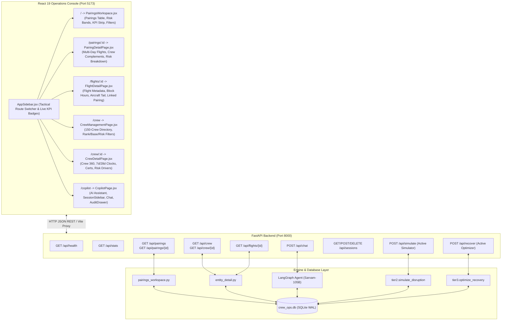

# Full-Stack Application Architecture: FastAPI & React 19 Console

This document details the **Full-Stack Application Layer** of the **dCortex Crew Operations Advisor**:
- **Backend API Layer:** FastAPI server in [`src/api/server.py`](file:///c:/Users/aayus/OneDrive/Desktop/bessemer_dcortex/src/api/server.py).
- **Frontend Console:** React 19 + React Router + Tailwind CSS NOC Operations Desk in [`frontend/`](file:///c:/Users/aayus/OneDrive/Desktop/bessemer_dcortex/frontend/).

---

## 1. System Architecture & Multi-Page Navigation



---

## 2. FastAPI Backend Layer ([`src/api/server.py`](file:///c:/Users/aayus/OneDrive/Desktop/bessemer_dcortex/src/api/server.py))

The backend exposes a high-performance REST API built with FastAPI and Pydantic:

### Production Endpoints Catalog

| Method | Route | Description | Request Body / Parameters | Response Model / Payload |
|:---|:---|:---|:---|:---|
| `GET` | `/api/health` | Health check endpoint returning status, engine, and snapshot date. | None | `{"status": "healthy", "service": "...", "snapshot_date": "2026-09-14"}` |
| `GET` | `/api/stats` | Fetches live counts (flights, crew, pairings, reserves) and active stations. | None | `StatsResponse` |
| `GET` | `/api/pairings` | Tactical Pairings Workspace query with KPI metrics and risk scores. | `date`, `aircraft`, `risk` | `{kpis: {...}, pairings: [...]}` |
| `GET` | `/api/pairings/{id}` | Detailed multi-day flight breakdown and crew complement for a pairing. | None | Full pairing detail JSON |
| `GET` | `/api/crew` | Full 150-crew directory with operational status and risk annotations. | `rank`, `base`, `risk` | List of crew summaries |
| `GET` | `/api/crew/{id}` | Crew 360: profile, 7d/28d rolling clocks, cert validities, active pairing. | None | Full crew detail JSON |
| `GET` | `/api/flights/{id}` | Flight metadata, block hours, aircraft registration, and linked pairing. | None | Full flight detail JSON |
| `POST` | `/api/chat` | Dispatches natural language operational query through LangGraph with memory. | `ChatRequest`<br>`{"query": "...", "session_id": "...", "tier": 1}` | `ChatResponse`<br>`{"response": "...", "tool_calls": [...], "session_id": "..."}` |
| `GET` | `/api/sessions` | Lists all chat sessions sorted by `updated_at DESC` with message counts. | None | `list[SessionItem]` |
| `POST` | `/api/sessions` | Creates a new chat session with an optional custom title. | `CreateSessionRequest` | `SessionItem` |
| `GET` | `/api/sessions/{id}` | Fetches full session metadata and uncompacted conversation history. | None | `{"session_id": "...", "messages": [...]}` |
| `DELETE`| `/api/sessions/{id}` | Cascades deletion of a session and all its messages. | None | `{"status": "deleted", "session_id": "..."}` |

---

## 3. React 19 Frontend Operations Console ([`frontend/src/`](file:///c:/Users/aayus/OneDrive/Desktop/bessemer_dcortex/frontend/src/))

The frontend is an airline Network Operations Control desk built with **React 19**, **Vite**, **React Router 7**, and **Tailwind CSS**:

### Multi-Page Routing Architecture ([`frontend/src/App.jsx`](file:///c:/Users/aayus/OneDrive/Desktop/bessemer_dcortex/frontend/src/App.jsx))

```jsx
<Routes>
  <Route path="/" element={<PairingsWorkspace />} />
  <Route path="/pairings/:pairingId" element={<PairingDetailPage />} />
  <Route path="/flights/:flightId" element={<FlightDetailPage />} />
  <Route path="/crew" element={<CrewManagementPage />} />
  <Route path="/crew/:crewId" element={<CrewDetailPage />} />
  <Route path="/copilot" element={<CopilotPage />} />
  <Route path="*" element={<Navigate to="/" replace />} />
</Routes>
```

### Key Page Modules:

#### 1. Tactical Pairings Workspace ([`PairingsWorkspace.jsx`](file:///c:/Users/aayus/OneDrive/Desktop/bessemer_dcortex/frontend/src/pages/PairingsWorkspace.jsx))
- **Live KPI Strip**: Active pairings, unassigned sectors, elevated risk pairings, and crew complement counters.
- **Filter Controls**: Calendar date picker (`2026-09-15`), aircraft tail filter (`VT-DXA` to `VT-DXF`), and risk level selector (`all`, `high`, `elevated`, `low`).
- **Interactive Pairing Table**: Shows pairing ID, aircraft, date, report/release times, assigned crew with role pills, and composite risk badge. Clicking any row navigates to the detailed pairing view.

#### 2. Pairing Detail Page ([`PairingDetailPage.jsx`](file:///c:/Users/aayus/OneDrive/Desktop/bessemer_dcortex/frontend/src/pages/PairingDetailPage.jsx))
- **Multi-Day Rotation Breakdown**: Displays individual calendar days for multi-day pairings.
- **Flight Sector Timeline**: Lists all operating legs, block times, departure/arrival stations, and aircraft.
- **Crew Complement Audit**: Lists assigned Captain, First Officer, Senior Cabin Crew, and Cabin Crew with fatigue metrics and certifications.

#### 3. Flight Detail Page ([`FlightDetailPage.jsx`](file:///c:/Users/aayus/OneDrive/Desktop/bessemer_dcortex/frontend/src/pages/FlightDetailPage.jsx))
- **Flight Sector 360**: Displays origin/destination airports, block hours, scheduled UTC and local times, seat capacity (162 for A320, 72 for ATR72), and clickable reverse link to the assigned pairing.

#### 4. Crew Directory & 360 Detail ([`CrewManagementPage.jsx`](file:///c:/Users/aayus/OneDrive/Desktop/bessemer_dcortex/frontend/src/pages/CrewManagementPage.jsx) & [`CrewDetailPage.jsx`](file:///c:/Users/aayus/OneDrive/Desktop/bessemer_dcortex/frontend/src/pages/CrewDetailPage.jsx))
- **Directory**: Real-time searchable list of all 150 pilots and cabin crew filtered by rank, base (BLR, BOM, DEL), and risk level.
- **Crew 360 Profile**: Displays home base, type ratings (`A320`, `ATR72`), reachability minutes, rolling 7-day duty hours, 28-day flight hours, remaining DGCA headroom, and validity dates for all 4 mandatory certifications.

#### 5. Conversational NOC Copilot ([`CopilotPage.jsx`](file:///c:/Users/aayus/OneDrive/Desktop/bessemer_dcortex/frontend/src/pages/CopilotPage.jsx))
- **Multi-Turn Session History Sidebar**: Add, search, and delete conversational investigation threads.
- **Quick Inquiry Chips**: One-click shortcuts for benchmark operational questions.
- **Collapsible Audit Drawer**: Deep explainability trace displaying exact tool dispatches and raw SQLite JSON payloads.

---

## 4. Startup & Port-Collision Safety

The application includes startup scripts for Windows PowerShell and Linux/macOS Bash:

### Windows PowerShell ([`start.ps1`](file:///c:/Users/aayus/OneDrive/Desktop/bessemer_dcortex/start.ps1))
```powershell
.\start.ps1
```
- Inspects ports `8000` and `5173` using `Get-NetTCPConnection`. If a server is already running, it reuses the process without throwing collisions.
- Automatically initializes the Python virtual environment (`.venv`) and installs `node_modules` if absent.

### Linux / macOS Bash ([`start.sh`](file:///c:/Users/aayus/OneDrive/Desktop/bessemer_dcortex/start.sh))
```bash
./start.sh
```
- Performs health polling on `http://127.0.0.1:8000` and `http://127.0.0.1:5173`.
- Handles graceful process teardown on `Ctrl+C` (`SIGINT` / `SIGTERM`).

---

## 5. Automated Verification & Testing

The backend API layer is verified by dedicated integration tests in [`tests/test_api.py`](file:///c:/Users/aayus/OneDrive/Desktop/bessemer_dcortex/tests/test_api.py):

```powershell
.venv\Scripts\pytest.exe tests/test_api.py -v
```

```
tests/test_api.py::test_health_endpoint PASSED
tests/test_api.py::test_stats_endpoint PASSED
tests/test_api.py::test_simulate_placeholder PASSED
tests/test_api.py::test_simulate_active_disruption PASSED
tests/test_api.py::test_recover_placeholder PASSED
tests/test_api.py::test_recover_active_event PASSED
tests/test_api.py::test_chat_empty_query PASSED
tests/test_api.py::test_chat_endpoint_mock PASSED
tests/test_api.py::test_chat_endpoint_with_session_id PASSED
tests/test_api.py::test_sessions_lifecycle PASSED
======================== 10 passed in 0.48s ========================
```
