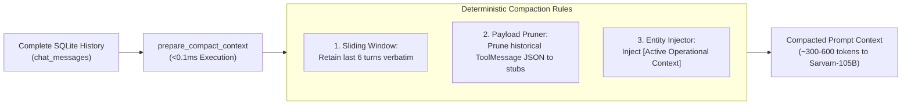

# LangGraph Function-Calling Agent Architecture & Reference

This document provides a technical explanation of the **LangGraph Conversational Function-Calling Agent** located in [`src/agent/`](file:///c:/Users/aayus/OneDrive/Desktop/bessemer_dcortex/src/agent/).

The agent operates as an intelligent airline NOC copilot: it interprets natural language inquiries from Crew Controllers, dynamically dispatches across 13 deterministic Python tools spanning all three operational tiers, extracts focus entities, and synthesizes compliance answers backed by an uncompacted audit trail.

---

## 1. High-Level Architecture & The Multi-Tier ReAct Loop

The agent is compiled using **LangGraph** (`StateGraph`) as a cyclic Reasoning & Acting (ReAct) workflow:

```mermaid
flowchart TD
    Start([START]) --> AgentNode["agent_node\n(Sarvam-105B Reasoning with 13 Bound Tools)"]
    
    AgentNode --> Decision{should_continue\nTool Calls Emitted?}
    
    Decision -->|Yes\n(e.g., query_crew_duty_balance,\nsimulate_disruption_impact,\noptimize_disruption_recovery)| ToolsNode["tools_node\n(Deterministic Python Execution)"]
    Decision -->|No\n(Final Answer Synthesized)| EndNode([END])
    
    ToolsNode -->|Tool Results Injected as ToolMessages| AgentNode
```

### Multi-Tier Execution Lifecycle:
1. **Tier 1 Lookup**: *"Who is the Captain on DX412 on 2026-09-15, and what is his 7-day duty balance?"*
   - Turn 1: Dispatches `query_flight_schedule(date='2026-09-15', flight_no='DX412')` $\to$ resolves Captain `C-1042`.
   - Turn 2: Dispatches `query_crew_duty_balance(crew_id='C-1042', as_of_date='2026-09-14')` $\to$ computes rolling duty hours.
2. **Tier 2 Rule Check**: *"Who can legally cover pairing P-2291 for Captain C-1042?"*
   - Dispatches `check_cover(pairing_id='P-2291', replace_crew_id='C-1042')`.
   - Returns `legal[]` and `excluded[].issues` from the rule engine.

---

## 2. Option A Deterministic Compaction (`prepare_compact_context`)

To prevent lossy LLM summarization (which risks rounding regulatory numbers like `59:45` $\to$ `~60h` and introduces high latency), the agent uses **Option A Deterministic Pre-Processing**:



### Compaction Mechanics:
1. **Pruning Historical JSON Payloads**: Historical `ToolMessage` payloads from earlier turns are compressed to verification stubs:
   ```json
   {"status": "verified", "note": "Data verified and incorporated in prior assistant answer"}
   ```
2. **Active Operational Context Injection**: Extracted entities are formatted into the system prompt:
   ```
   [Active Operational Context]
     * crew_id: C-1042
     * flight_no: DX412
     * aircraft: VT-DXC
   (When resolving relative references such as 'his/her', 'that flight', refer to these active entities).
   ```
3. **Coreference & Pronoun Resolution**: Seamless multi-turn inquiries (e.g. *"Who operates DX412?"* followed by *"What is his 7-day duty balance?"* $\to$ automatically targets `C-1042`).

---

## 3. Dynamic Entity Extractor (`extract_active_entities`)

[`extract_active_entities`](file:///c:/Users/aayus/OneDrive/Desktop/bessemer_dcortex/src/agent/graph.py) uses a generic schema-agnostic extraction engine across all three tiers:

```python
IGNORED_PARAMS = {"as_of_date", "date", "start_date", "end_date", "limit", "offset", "dry_run"}
CORE_ENTITY_KEYS = {"crew_id", "flight_no", "aircraft", "pairing_id", "station", "scenario_id", "candidate_id", "swap_crew_id"}

def extract_active_entities(args: dict[str, Any], existing_entities: dict[str, str] | None = None) -> dict[str, str]:
    entities = dict(existing_entities or {})
    for key, val in args.items():
        if val and key not in IGNORED_PARAMS:
            if key in CORE_ENTITY_KEYS or key.endswith(("_id", "_no", "_code", "_reg")):
                entities[key] = str(val).strip()
    return entities
```

---

## 4. LangChain Tool Registry Catalog (13 Tools)

All 13 deterministic operational tools in [`src/agent/tools.py`](file:///c:/Users/aayus/OneDrive/Desktop/bessemer_dcortex/src/agent/tools.py) are registered as typed LangChain `@tool` functions:

### Tier 1 Lookup Tools (`TIER1_TOOLS` — 10 Tools)
| Tool Name | Parameters | Target Handler |
|:---|:---|:---|
| `query_flight_schedule` | `date`, `origin`, `destination`, `flight_no`, `aircraft`, `aircraft_type`, `distinct_destinations`, `count_only` | `src.tier1.get_flights` |
| `query_station_departures` | `station`, `date`, `start_time`, `end_time` | `src.tier1.get_departures` |
| `query_station_arrivals` | `station`, `date`, `start_time`, `end_time` | `src.tier1.get_arrivals` |
| `query_flight_schedule_stats`| `metric` (`longest_block`, `shortest_block`, `busiest_station`) | `src.tier1.get_flight_schedule_stats` |
| `query_crew_profile` | `crew_id`, `rank`, `base`, `rating`, `status` | `src.tier1.get_crew_profile` |
| `query_reserve_crew` | `station`, `date`, `rank` | `src.tier1.get_reserves_at_station` |
| `query_pairing_roster` | `pairing_id`, `crew_id`, `aircraft`, `date`, `role` | `src.tier1.get_pairing_roster` |
| `query_crew_duty_balance` | `crew_id`, `as_of_date` | `src.tier1.get_crew_duty_balance` |
| `query_expiring_certifications`| `as_of_date`, `days_ahead`, `cert_type`, `crew_id` | `src.tier1.get_expiring_certifications` |
| `query_crew_risk_signal` | `crew_id`, `min_score` | `src.tier1.get_crew_risk_signal` |

### Tier 2 Rule-Check Tools (`TIER2_TOOLS`)
Lookups and legality checks: `query_pairing`, `query_crew_detail`, `query_flight_duty_times`, `query_station_movements`, `query_database`, `query_cost_rates`, `check_fdp_limit`, `check_duty_7d`, `check_flight_28d`, `check_rest`, `check_qualification`, `check_certifications`, `check_base_positioning`, `check_cover`.

```python
ALL_TOOLS = TIER1_TOOLS + TIER2_TOOLS
TOOL_MAP = {t.name: t for t in ALL_TOOLS}
```

---

## 5. Agent State Schema ([`src/agent/state.py`](file:///c:/Users/aayus/OneDrive/Desktop/bessemer_dcortex/src/agent/state.py))

```python
class AgentState(TypedDict):
    messages: Annotated[list[BaseMessage], add_messages]  # Conversation turn thread
    user_query: str                                      # Current controller prompt
    tier: int                                            # Operational context tier (1, 2, 3)
    session_id: str                                      # Multi-turn session ID
    active_entities: dict[str, str]                      # Dynamic domain entity registry
    tool_calls: list[dict[str, Any]]                     # Dispatched tool records
    tool_results: list[dict[str, Any]]                   # Tool returns from SQLite/Python
    reasoning_trace: list[str]                           # Explainability audit trail
    final_response: str                                  # Synthesized response for controller
```

---

## 6. Automated Verification & Testing

The agent and router layer is verified by unit tests in [`tests/test_router.py`](file:///c:/Users/aayus/OneDrive/Desktop/bessemer_dcortex/tests/test_router.py):

```powershell
.venv\Scripts\pytest.exe tests/test_router.py -v
```

```
tests/test_router.py::test_tool_registry_completeness PASSED
tests/test_router.py::test_graph_compilation PASSED
tests/test_router.py::test_should_continue_logic PASSED
tests/test_router.py::test_tools_node_execution PASSED
tests/test_router.py::test_tools_node_unknown_tool_handling PASSED
tests/test_router.py::test_tools_node_tier2_and_tier3_execution PASSED
======================== 6 passed in 0.42s ========================
```
