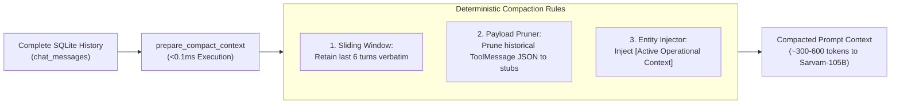
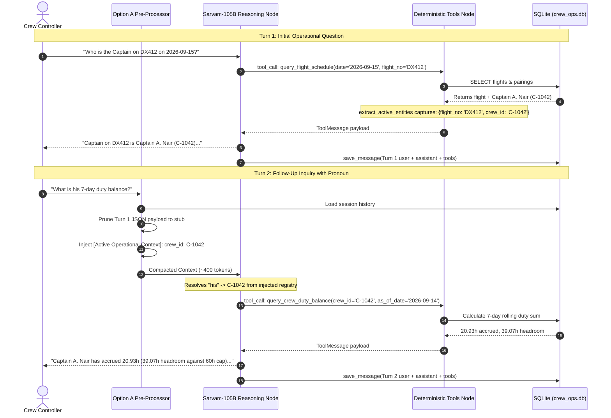

# LangGraph Function-Calling Agent Architecture & Reference

This document provides a technical explanation of the **LangGraph Conversational Function-Calling Agent** located in [`src/agent/`](file:///c:/Users/aayus/OneDrive/Desktop/bessemer_dcortex/src/agent/).

The agent operates as an intelligent airline NOC copilot: it interprets natural language questions from Crew Controllers, binds to deterministic Python tools, extracts operational arguments, and synthesizes structured compliance summaries backed by an uncompacted audit trail.

---

## 1. High-Level Architecture & The ReAct Loop

The agent is compiled using **LangGraph** (`StateGraph`) as a cyclic Reasoning & Acting (ReAct) workflow:

```mermaid
flowchart TD
    Start([START]) --> AgentNode["agent_node\n(Sarvam-105B Reasoning with Bound Tools)"]
    
    AgentNode --> Decision{should_continue\nTool Calls Emitted?}
    
    Decision -->|Yes\n(e.g., query_crew_duty_balance)| ToolsNode["tools_node\n(Deterministic SQLite Execution)"]
    Decision -->|No\n(Final Answer Synthesized)| EndNode([END])
    
    ToolsNode -->|Tool Results Injected as ToolMessages| AgentNode
```

### Execution Lifecycle of a Query
1. **Controller Query:** Controller asks: *"Who is the Captain on DX412 on 2026-09-15, and what is his 7-day duty balance?"*
2. **Deterministic Context Pre-Processing (Option A):** Prior conversation turns are loaded from SQLite `chat_messages` and compacted to $\sim 400$ tokens.
3. **Agent Node (`agent_node`):** Sarvam-105B analyzes the prompt against the system instructions and emits a structured tool call:
   `query_flight_schedule(date='2026-09-15', flight_no='DX412')`.
4. **Conditional Routing (`should_continue`):** Detects tool call $\to$ routes to `tools_node`.
5. **Tool Execution Node (`tools_node`):** Executes the Python query against SQLite (`crew_ops.db`), records the raw JSON payload in state, and dynamically captures focus entities (`flight_no: DX412`, `crew_id: C-1042`).
6. **Cyclic Re-Entry (`tools_node` $\to$ `agent_node`):** Sarvam-105B inspects the tool response, resolves the Captain as `C-1042`, and emits the second tool call:
   `query_crew_duty_balance(crew_id='C-1042', as_of_date='2026-09-14')`.
7. **Synthesis & Termination:** Sarvam-105B receives the duty metrics, crafts a concise Markdown table citing DGCA `RULE-DUTY-02`, and routes to `END`.
8. **Persistence:** The full uncompacted turn is saved to SQLite `chat_messages`.

---

## 2. Option A Deterministic Compaction (`prepare_compact_context`)

Instead of using lossy LLM summarization (which risks rounding numbers like `59:45` $\to$ `~60h` and introduces a 3–5 second latency stall on every turn), the agent uses **Option A Deterministic Python Pre-Processing**:



### Compaction Mechanics:
1. **Pruning Heavy Historical JSON:**
   Historical `ToolMessage` payloads from earlier turns are compressed to lightweight verification stubs:
   ```json
   {"status": "verified", "note": "Data verified and incorporated in prior assistant answer"}
   ```
2. **Active Operational Context Injection:**
   Extracted entities are formatted into the system prompt:
   ```
   [Active Operational Context]
     * crew_id: C-1042
     * flight_no: DX412
     * aircraft: VT-DXC
   (When resolving relative references such as 'his/her', 'that flight', refer to these active entities).
   ```
3. **Coreference & Pronoun Resolution:**
   Enables seamless multi-turn inquiries:
   - Turn 1: *"Who operates DX412 on 2026-09-15?"*
   - Turn 2: *"What is his 7-day duty balance?"* $\to$ Automatically targets `C-1042`.



---

## 3. Dynamic Entity Extractor (`extract_active_entities`)

Rather than relying on brittle, hardcoded argument checks, [`extract_active_entities`](file:///c:/Users/aayus/OneDrive/Desktop/bessemer_dcortex/src/agent/graph.py) uses a generic schema-agnostic extraction engine:

```python
IGNORED_PARAMS = {"as_of_date", "date", "start_date", "end_date", "limit", "offset", "dry_run"}
CORE_ENTITY_KEYS = {"crew_id", "flight_no", "aircraft", "pairing_id", "station", "scenario_id", "candidate_id", "swap_crew_id"}

def extract_active_entities(args: dict[str, Any], existing_entities: dict[str, str] | None = None) -> dict[str, str]:
    entities = dict(existing_entities or {})
    for key, val in args.items():
        if val and key not in IGNORED_PARAMS:
            if key in CORE_ENTITY_KEYS or key.endswith(("_id", "_no", "_code", "_reg")):
                entities[key] = str(val).strip()
    return entities
```
- **Unified Scalability:** Works identically across Tier 1 (Lookups), Tier 2 (Disruptions), and Tier 3 (Recovery).

---

## 4. LangChain Tool Registry (`src/agent/tools.py`)

All 10 deterministic query handlers are registered as typed LangChain `@tool` definitions:

| Tool Name | Parameters | Target Handler |
|:---|:---|:---|
| `query_flight_schedule` | `date`, `origin`, `destination`, `flight_no`, `aircraft`, `aircraft_type`, `distinct_destinations`, `count_only` | `src.tier1.get_flights` |
| `query_station_departures` | `station`, `date`, `start_time`, `end_time` | `src.tier1.get_departures` |
| `query_station_arrivals` | `station`, `date`, `start_time`, `end_time` | `src.tier1.get_arrivals` |
| `query_flight_schedule_stats`| `metric` (`longest_block`, `shortest_block`, `busiest_station`) | `src.tier1.get_flight_schedule_stats` |
| `query_crew_profile` | `crew_id`, `rank`, `base`, `rating`, `status` | `src.tier1.get_crew_profile` |
| `query_reserve_crew` | `station`, `date`, `rank` | `src.tier1.get_reserves_at_station` |
| `query_pairing_roster` | `pairing_id`, `crew_id`, `aircraft`, `date`, `role` | `src.tier1.get_pairing_roster` |
| `query_crew_duty_balance` | `crew_id`, `as_of_date` | `src.tier1.get_crew_duty_balance` |
| `query_expiring_certifications`| `as_of_date`, `days_ahead`, `cert_type`, `crew_id` | `src.tier1.get_expiring_certifications` |
| `query_crew_risk_signal` | `crew_id`, `min_score` | `src.tier1.get_crew_risk_signal` |

---

## 5. Agent State Schema (`src/agent/state.py`)

```python
class AgentState(TypedDict):
    messages: Annotated[list[BaseMessage], add_messages]  # Chat message thread
    user_query: str                                      # Current controller prompt
    tier: int                                            # Operational context tier (1, 2, 3)
    session_id: str                                      # Multi-turn session identifier
    active_entities: dict[str, str]                      # Dynamic domain entity registry
    tool_calls: list[dict[str, Any]]                     # Extracted tool dispatch records
    tool_results: list[dict[str, Any]]                   # Tool execution returns
    reasoning_trace: list[str]                           # Explainability reasoning audit log
    final_response: str                                  # Synthesized response for controller
```

---

## 6. Public Python Usage & Verification

### Running the Agent in Python
```python
from src.agent import run_crew_ops_agent

# Turn 1
r1 = run_crew_ops_agent(
    query="Who is the Captain on flight DX412 on 2026-09-15?",
    session_id="noc_desk_1",
)
print("Turn 1:", r1["final_response"])

# Turn 2 (Pronoun Resolution)
r2 = run_crew_ops_agent(
    query="What is his 7-day duty balance?",
    session_id="noc_desk_1",
)
print("Turn 2:", r2["final_response"])
print("Tool Calls:", r2["tool_calls"])
```

### Unit Tests
```powershell
.venv\Scripts\pytest.exe tests/test_router.py -v
```

Output:
```
tests/test_router.py::test_tool_registry_completeness PASSED
tests/test_router.py::test_graph_compilation PASSED
tests/test_router.py::test_should_continue_logic PASSED
tests/test_router.py::test_tools_node_execution PASSED
tests/test_router.py::test_tools_node_unknown_tool_handling PASSED
======================== 5 passed in 0.38s ========================
```
