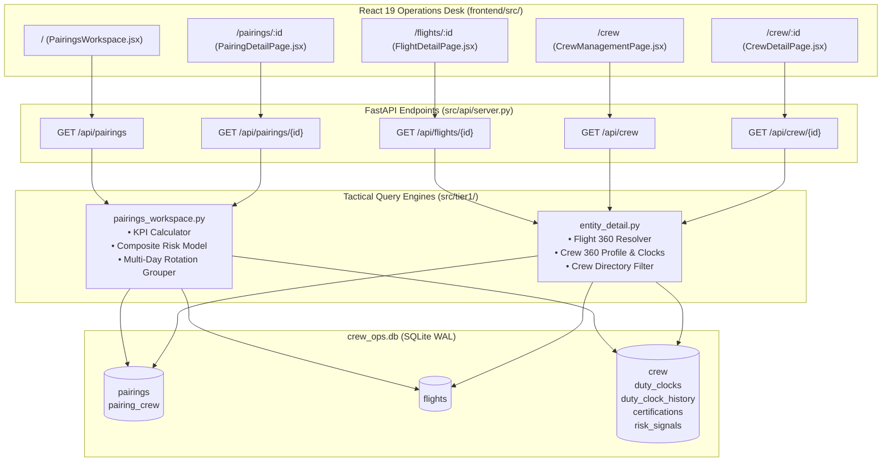

# Tactical Pairings Workspace & Entity 360 Architecture & Reference

This document details the **Tactical Pairings Workspace Engine** ([`src/tier1/pairings_workspace.py`](file:///c:/Users/aayus/OneDrive/Desktop/bessemer_dcortex/src/tier1/pairings_workspace.py)) and the **Entity 360 Detail Service** ([`src/tier1/entity_detail.py`](file:///c:/Users/aayus/OneDrive/Desktop/bessemer_dcortex/src/tier1/entity_detail.py)).

These services power the React 19 NOC Operations Desk: providing real-time pairing roster risk evaluation, fleet KPI aggregation, multi-day rotation grouping, and detailed operational drilldowns for all 147 flights and 150 crew members.

---

## 1. System Architecture & UI Data Flow

---

## 2. Tactical Pairings Workspace Engine (`src/tier1/pairings_workspace.py`)

### A. Live KPI Metric Calculation
Every workspace query returns network-wide KPI summary metrics for the active operational date:
- **`active_pairings`**: Total count of pairings scheduled to operate.
- **`unassigned_sectors`**: Count of flight legs lacking complete crew staffing.
- **`elevated_risk`**: Count of pairings carrying a composite risk score $\ge 0.3$.
- **`crew_complement`**: Total distinct active crew members rostered across the active pairings.

### B. Composite Pairing Risk Scoring Algorithm
A pairing's risk score $R \in [0.0, 1.0]$ is derived dynamically by evaluating three potential points of failure:
$$R = \max(R_{\text{disruption}}, R_{\text{duty}}, R_{\text{cert}})$$

1. **Crew Disruption Risk ($R_{\text{disruption}}$)**:
   - Fetched directly from `risk_signals.disruption_risk_score` for each assigned pilot and cabin crew member.
2. **Duty Near-Limit Penalty ($R_{\text{duty}}$)**:
   - Evaluates crew rolling duty headroom against DGCA caps.
   - If 7-day cumulative duty exceeds $55.0\text{h}$ (within $5\text{h}$ of $60.0\text{h}$ cap) or 28-day flight time exceeds $90.0\text{h}$ (within $10\text{h}$ of $100.0\text{h}$ cap), risk is boosted into the elevated band ($0.45$).
3. **Imminent Certificate Expiry ($R_{\text{cert}}$)**:
   - If any assigned crew member holds a certification expiring on the duty date or within 24 hours, the pairing risk is flagged as **`1.0` (Critical / Grounding Risk)**.

### C. Risk Banding Hierarchy:
| Band Name | Score Range | UI Badge Color | Operational Protocol |
|:---|:---:|:---:|:---|
| **Critical** | $1.0$ | Red (`#f43f5e`) | Immediate operational action required; potential grounding (e.g. expired license). |
| **High** | $> 0.70$ | Orange (`#f97316`) | Active reserve pre-alerted; controller monitoring rotation for duty breaches. |
| **Elevated** | $0.30 - 0.70$ | Amber (`#f59e0b`) | Watchlist pairing; crew near 7d/28d fatigue thresholds. |
| **Low** | $< 0.30$ | Green (`#10b981`) | Normal operations; legal headroom confirmed. |

### D. Multi-Day Rotation Integrity
Pairings like `P-2291` span two calendar days (Day 1: BLR $\to$ DEL with overnight layover, Day 2: DEL $\to$ BOM). 
- When a controller filters by `date = '2026-09-15'`, the workspace engine **keeps both Day 1 and Day 2 connected in the response payload**.
- *Why:* A disruption on Day 1 breaks the aircraft and crew layover on Day 2; controllers must always view the complete multi-day duty rotation.

---

## 3. Entity 360 Detail Service (`src/tier1/entity_detail.py`)

### A. Flight 360 (`get_flight_detail`)
Returns comprehensive operational metadata for an individual flight:
- Route geometry: departure station, arrival station, scheduled UTC departure/arrival, local times.
- Operating aircraft: tail registration (`VT-DXC`), aircraft type (`A320`), total seats (`162`).
- Linked Pairing Resolution: Uses SQLite `json_each(flights_json)` to discover which pairing contains this flight sector.

### B. Crew 360 (`get_crew_detail`)
Assembles an authoritative operational profile for a crew member:
- Personal & Station: Name, rank (`Captain`), home base (`DEL`), ratings (`["A320"]`), seniority, reachability minutes.
- Rolling Duty Balances: Exact accrued 7-day duty hours, 28-day flight hours, and headroom against DGCA caps.
- Certification Status: Validity dates for all 4 mandatory certificates (`licence`, `medical_class1`, `recurrent_training`, `dangerous_goods`).
- Active Schedule: Scheduled pairings, report times, layover hotels, and flight legs assigned in the roster.
- Disruption Risk: Disruption score ($0.0 - 1.0$) and qualitative driver tags (e.g. `["short-rest pattern"]`).

### C. Crew Directory Directory (`list_crew`)
Provides full-network crew roster queries:
- Supports multi-attribute filtering: `rank`, `base`, `risk` (`"high"`, `"elevated"`, `"low"`).
- Automatically enriches each crew record with their current assignment status (rostered pairing vs off-duty vs standby reserve).

---

## 4. REST API Endpoint Specifications

| Method | Endpoint | Query Parameters | Description |
|:---|:---|:---|:---|
| `GET` | `/api/pairings` | `date`, `aircraft`, `risk` | Returns filtered pairing rows, calculated risk scores, and aggregate network KPIs. |
| `GET` | `/api/pairings/{id}` | None | Detailed breakdown of all days, flights, and assigned crew for a pairing. |
| `GET` | `/api/crew` | `rank`, `base`, `risk` | Full 150-crew directory with operational status and risk annotations. |
| `GET` | `/api/crew/{id}` | None | Comprehensive 360-degree profile, duty clocks, certificates, and current pairings. |
| `GET` | `/api/flights/{id}` | None | Complete flight metadata, seat counts, block time, and linked pairing identifier. |

---

## 5. Automated Verification & Testing

These engines are verified by **31 dedicated unit tests**:

### A. Pairings Workspace Suite ([`tests/test_pairings_workspace.py`](file:///c:/Users/aayus/OneDrive/Desktop/bessemer_dcortex/tests/test_pairings_workspace.py)) (20 Tests)
- `test_workspace_kpis_match_dataset`: Verifies network KPI metrics.
- `test_p2291_is_two_day_rotation_with_highlighted_captain`: Verifies 2-day rotation grouping.
- `test_date_filter_keeps_full_multi_day_pairing`: Confirms sequence preservation under filters.
- `test_high_risk_filter_excludes_low_pairings`: Validates risk band filtering.
- `test_expired_cert_sets_pairing_risk_to_one`: Verifies cert risk elevation to $1.0$.
- `test_duty_risk_matches_bar_bands`: Verifies duty near-limit risk elevation.
- `test_pairings_api_endpoint_shape`: Validates JSON schema shape and HTTP 200 responses.

### B. Entity Detail Suite ([`tests/test_entity_detail.py`](file:///c:/Users/aayus/OneDrive/Desktop/bessemer_dcortex/tests/test_entity_detail.py)) (11 Tests)
- `test_flight_detail_dx412`: Validates DX412 flight details, seat counts, and pairing links.
- `test_crew_detail_c1042`: Validates Captain C-1042 profile, duty clocks, and certs.
- `test_list_crew_covers_dataset`: Verifies 150-crew directory coverage.
- `test_list_crew_rank_filter`: Validates rank filtering (Captain, First Officer, Cabin Crew).
- `test_flight_detail_api_404` & `test_crew_detail_api_404`: Validates graceful 404 handling.
