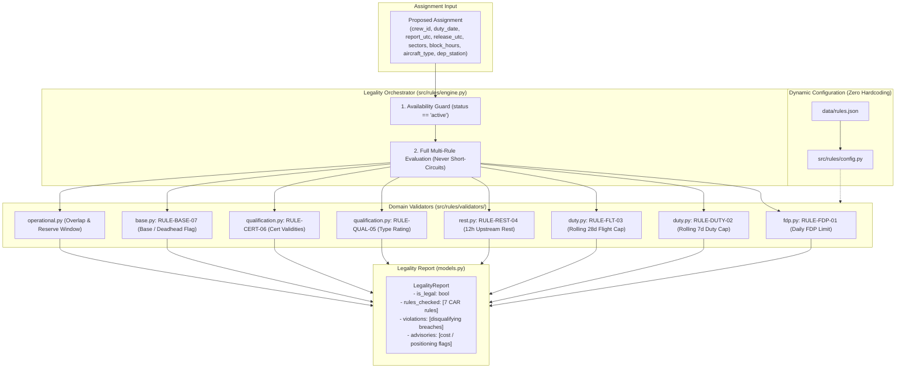

# DGCA CAR Legality Rules Engine Architecture & Reference

This document provides a technical explanation of the **Deterministic Legality Rules Engine** located in [`src/rules/`](file:///c:/Users/aayus/OneDrive/Desktop/bessemer_dcortex/src/rules/).

The rules engine is the **Single Source of Truth** for airline operational legality under **DGCA CAR Section 7, Series J**. It operates with **zero LLM arithmetic**, zero hallucination, and exact microsecond-precision timestamp calculations directly against SQLite.

---

## 1. Engine Architecture & Component Flow



---

## 2. The 7 DGCA CAR Rules Evaluated

All 7 rules are read dynamically at runtime from [`data/rules.json`](file:///c:/Users/aayus/OneDrive/Desktop/bessemer_dcortex/data/rules.json) via [`src/rules/config.py`](file:///c:/Users/aayus/OneDrive/Desktop/bessemer_dcortex/src/rules/config.py). There is **zero hardcoding** of regulatory thresholds in Python logic.

| Rule ID | CAR Regulation Name | Regulatory Formula / Threshold | Disqualifying? | Module & Function |
|:---|:---|:---|:---|:---|
| **`RULE-FDP-01`** | Flight Duty Period Limit | $\text{Limit} = 13.0\text{h} - 0.5\text{h} \times \max(0, \text{sectors} - 2)$<br>• 1–2 sectors: **13.0h**<br>• 3 sectors: **12.5h**<br>• 4 sectors: **12.0h**<br>• 5 sectors: **11.5h** | **YES** | [`validators/fdp.py`](file:///c:/Users/aayus/OneDrive/Desktop/bessemer_dcortex/src/rules/validators/fdp.py)<br>`check_fdp` |
| **`RULE-DUTY-02`** | 7-Day Cumulative Duty Limit | $\sum_{d=0}^{6} \text{DutyHours}_d + \text{ProposedDuty} \le 60.0\text{h}$<br>Evaluated over a rolling 7-calendar-day window ending on the duty date. | **YES** | [`validators/duty.py`](file:///c:/Users/aayus/OneDrive/Desktop/bessemer_dcortex/src/rules/validators/duty.py)<br>`check_duty_7d` |
| **`RULE-FLT-03`** | 28-Day Flight Time Limit | $\sum_{d=0}^{27} \text{FlightHours}_d + \text{ProposedBlock} \le 100.0\text{h}$<br>Evaluated over a rolling 28-calendar-day window ending on the duty date. | **YES** | [`validators/duty.py`](file:///c:/Users/aayus/OneDrive/Desktop/bessemer_dcortex/src/rules/validators/duty.py)<br>`check_flight_28d` |
| **`RULE-REST-04`** | Minimum Rest Period | $\text{ReportUTC} - \text{PriorReleaseUTC} \ge 12.0\text{h}$<br>Evaluates both **upstream rest** (rest before this duty) and **downstream rest** (rest before the next scheduled duty). | **YES** | [`validators/rest.py`](file:///c:/Users/aayus/OneDrive/Desktop/bessemer_dcortex/src/rules/validators/rest.py)<br>`check_rest`<br>`check_downstream_rest` |
| **`RULE-QUAL-05`** | Aircraft Type Rating | $\text{aircraft\_type} \in \text{crew\_ratings}$<br>E.g. A320 captain cannot operate ATR72 unless holding dual type rating. | **YES** | [`validators/qualification.py`](file:///c:/Users/aayus/OneDrive/Desktop/bessemer_dcortex/src/rules/validators/qualification.py)<br>`check_qualification` |
| **`RULE-CERT-06`** | Certification Validity | $\forall c \in \text{certs}: \text{valid\_to}_c \ge \text{duty\_date}$<br>Checked across 4 mandatory certificates: Licence, Medical Class 1, Recurrent Training, Dangerous Goods. | **YES** | [`validators/qualification.py`](file:///c:/Users/aayus/OneDrive/Desktop/bessemer_dcortex/src/rules/validators/qualification.py)<br>`check_certifications` |
| **`RULE-BASE-07`** | Base Alignment & Deadhead | $\text{crew\_base} == \text{dep\_station}$<br>If stations differ, crew requires deadhead positioning. | **NO**<br>*(Cost Flag / Advisory)* | [`validators/base.py`](file:///c:/Users/aayus/OneDrive/Desktop/bessemer_dcortex/src/rules/validators/base.py)<br>`check_base` |

---

## 3. Operational Feasibility Constraints (`src/rules/operational.py`)

In addition to the 7 CAR regulatory checks, the engine enforces operational constraints required in NOC airline operations:

1. **Schedule Overlap / Double-Booking (`check_schedule_overlap`)**:
   - Queries `pairings` and `pairing_crew` in SQLite to verify whether the crew member is already flying another leg at the proposed time:
     ```sql
     SELECT p.pairing_id, p.date, p.report_utc, p.release_utc
     FROM pairings p
     JOIN pairing_crew pc ON pc.pairing_id = p.pairing_id
     WHERE pc.crew_id = ?
       AND p.report_utc < ? AND p.release_utc > ?
     ```
   - If an overlap exists, returns `rule_id="DOUBLE_BOOKED"`, disqualifying the candidate.

2. **Downstream Turnaround Rest Conflict (`check_downstream_rest`)**:
   - Ensures that assigning a replacement duty today does not illegally shorten the rest period before the crew member's **next scheduled duty** later in the week below 12 hours.

3. **Reserve Standby On-Call Window (`check_reserve_window`)**:
   - For reserve crew, verifies that the flight duty report time falls strictly within the published `oncall_window_utc` (e.g. `06:00`–`18:00 UTC`).

---

## 4. Architectural Principles

### A. Never Short-Circuit (Complete Explainability)
The orchestrator in `src/rules/engine.py` runs **all 7 rules on every evaluation**, even if the first rule fails. 
- *Why:* In operations recovery, if a candidate fails FDP and also has an expired medical and a base mismatch, the NOC controller must see the complete picture in the audit log, rather than fixing one violation only to encounter another.

### B. High-Precision Rolling Window Calculations
Rolling calculations (`calculate_rolling_sum` in `src/rules/time_utils.py`) pull from the 4,200 rows of `duty_clock_history` in SQLite:
- Seamlessly blends past completed duties (`duty_clock_history`), planned published duties in the roster (`pairings`), and multi-day simulated covers.
- Automatically handles exclude pairings (e.g. when evaluating a pilot swapping out of their existing duty).

### C. Multi-Day Pairing Accumulation (`check_crew_legality_for_pairing`)
When evaluating a multi-day pairing (e.g. Day 1: BLR $\to$ DEL with overnight layover, Day 2: DEL $\to$ BOM):
- Day 1 is evaluated against the crew member's initial state.
- The engine chains Day 1's `release_utc` into Day 2's `report_utc` for overnight rest verification.
- Duty and flight hours accumulated on Day 1 are passed into Day 2's 7-day and 28-day rolling window checks.
- On Day 2+, the departure station is automatically recognized as the layover station rather than requiring an erroneous cross-base deadhead flag.

---

## 5. Public Python API

### 1. `check_crew_legality`
Evaluates a single duty day:

```python
from src.rules import check_crew_legality
from src.tier1.connection import get_connection

conn = get_connection()
report = check_crew_legality(
    crew_id="C-1042",
    proposed_assignment={
        "pairing_id": "P-2291",
        "duty_date": "2026-09-15",
        "report_utc": "2026-09-15T02:00:00Z",
        "release_utc": "2026-09-15T12:45:00Z",
        "sectors": 4,
        "block_hours": 7.5,
        "aircraft_type": "A320",
        "dep_station": "BLR",
    },
    conn=conn,
)

print(report["is_legal"])       # True or False
print(report["violations"])     # List of rule violations with breach amounts
print(report["advisories"])     # Base deadhead advisories
```

### 2. `check_crew_legality_for_pairing`
Evaluates all days of a multi-day pairing sequence:

```python
from src.rules import check_crew_legality_for_pairing

report = check_crew_legality_for_pairing(
    crew_id="C-1042",
    pairing_id="P-2291",
    conn=conn,
    duty_date="2026-09-15",
)
```

---

## 6. Test Suite & Verification

The rules engine is verified by dedicated unit tests in [`tests/test_rules.py`](file:///c:/Users/aayus/OneDrive/Desktop/bessemer_dcortex/tests/test_rules.py):

```powershell
.venv\Scripts\pytest.exe tests/test_rules.py -v
```

### Verified Test Cases:
1. `test_fdp_limits`: Validates sector thresholds (1–2 sectors: 13.0h, 3 sectors: 12.5h, 4 sectors: 12.0h, 5 sectors: 11.5h).
2. `test_duty_7d_limits`: Verifies exact rolling sums (C-1042 20.93h duty; C-2087 exceeding 60h cap by 1h20m).
3. `test_flight_28d_limits`: Verifies 100h cap breaches over 28 calendar days.
4. `test_rest_limits`: Validates 12h upstream rest and sub-12h rest conflict detection.
5. `test_qualifications`: Verifies type rating checks (A320 vs ATR72).
6. `test_certifications`: Verifies expired certificate detection against duty dates.
7. `test_base_alignment`: Confirms `RULE-BASE-07` functions as a non-disqualifying financial advisory.
8. `test_operational_constraints`: Validates double-booking and reserve window checks.
9. `test_multi_day_pairing_legality`: Verifies multi-day sequential accumulation.
