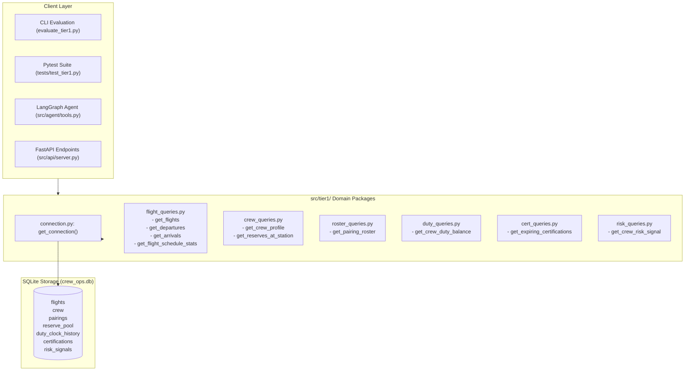

# Tier 1 Query Engine & Benchmark Suite Architecture

This document details the **Tier 1 Operational Query Engine** located in [`src/tier1/`](file:///c:/Users/aayus/OneDrive/Desktop/bessemer_dcortex/src/tier1/).

Tier 1 provides deterministic, sub-millisecond query execution against SQLite (`crew_ops.db`) for airline flight movements, crew rosters, standby reserve pools, DGCA rolling duty balances, and certification validities.

---

## 1. Architectural Philosophy: Deterministic Data Access

In airline operations control, hallucinating flight schedules, miscalculating duty balances, or confusing aircraft tail registrations can breach DGCA CAR regulations and ground flights. 

Tier 1 adheres to three core architectural principles:
1. **Zero LLM Arithmetic**: All operational calculations (rolling duty hours, headroom against 60h caps, expiry windows, departure counts) are computed using exact Python arithmetic directly against SQLite.
2. **Clean Domain Modularization**: The query layer is organized by domain responsibilities (`flight_queries.py`, `crew_queries.py`, `roster_queries.py`, `duty_queries.py`, `cert_queries.py`, `risk_queries.py`), ensuring single-responsibility and separation of concerns.
3. **Re-Usable Connection Management**: Every handler accepts an optional `conn: sqlite3.Connection`, enabling in-memory testing, transaction reuse, and seamless integration with FastAPI, Pytest, and the LangGraph tool layer.

---

## 2. Module Breakdown & Public Handlers



### Handler Catalog

| Module | Handler Function | Purpose & Capabilities | Primary Tables |
|:---|:---|:---|:---|
| [`flight_queries.py`](file:///c:/Users/aayus/OneDrive/Desktop/bessemer_dcortex/src/tier1/flight_queries.py) | `get_flights` | Filters schedules by date, origin, destination, flight number, aircraft tail, or fleet type. Supports `distinct_destinations=True` and `count_only=True`. | `flights` |
| | `get_departures` | Station departures ordered by departure time. | `flights` |
| | `get_arrivals` | Station arrivals ordered by arrival time. | `flights` |
| | `get_flight_schedule_stats` | Metric extraction: `longest_block`, `shortest_block`, or `busiest_station`. | `flights` |
| [`crew_queries.py`](file:///c:/Users/aayus/OneDrive/Desktop/bessemer_dcortex/src/tier1/crew_queries.py) | `get_reserves_at_station` | Retrieves active crew on reserve at an airport on a date, including on-call standby windows (`start`, `end`) and ranks. Exclusively filters `status='active'`. | `reserve_pool`<br>`crew` |
| | `get_crew_profile` | Full profile lookup for a crew member (base, ratings, reachability, reserve window) or crew search filtered by rank/base/rating. | `crew`<br>`reserve_pool` |
| [`roster_queries.py`](file:///c:/Users/aayus/OneDrive/Desktop/bessemer_dcortex/src/tier1/roster_queries.py) | `get_pairing_roster` | **Bi-directional roster lookup:**<br>1. Forward: assigned crew for pairing ID or aircraft tail & date.<br>2. Reverse: scheduled pairings and flight legs assigned to a crew member. | `pairings`<br>`pairing_crew` |
| [`duty_queries.py`](file:///c:/Users/aayus/OneDrive/Desktop/bessemer_dcortex/src/tier1/duty_queries.py) | `get_crew_duty_balance` | Calculates exact accrued rolling 7-day duty hours, 28-day flight hours, and remaining headroom against 60h and 100h caps across any snapshot date. | `duty_clock_history`<br>`pairings`<br>`crew` |
| [`cert_queries.py`](file:///c:/Users/aayus/OneDrive/Desktop/bessemer_dcortex/src/tier1/cert_queries.py) | `get_expiring_certifications` | Sliding-window certification query: identifies licences, medicals, recurrent checks expiring within `[as_of_date, as_of_date + days_ahead]`. | `certifications` |
| [`risk_queries.py`](file:///c:/Users/aayus/OneDrive/Desktop/bessemer_dcortex/src/tier1/risk_queries.py) | `get_crew_risk_signal` | Returns pre-computed disruption and fatigue risk scores and driver description tags. | `risk_signals` |

---

## 3. Deep Dive into Complex Query Handlers

### A. Dynamic Rolling Duty & Headroom (`get_crew_duty_balance`)
Evaluating a pilot's 7-day duty hours must account for two distinct periods:
1. **Historical Records ($\le$ Snapshot Date):** Read from `duty_clock_history` (4,200 rows in SQLite).
2. **Planned Roster Duties ($>$ Snapshot Date):** Dynamically aggregated from published `pairings` table rows.

```python
# Rolling 7-day calculation
duty_7d = round(
    calculate_rolling_sum(c, crew_id, end_dt, DUTY_WINDOW_DAYS, "duty_hours"),
    2,
)
duty_headroom = round(max(0.0, DUTY_MAX_HOURS - duty_7d), 2)
```
- **Example:** For Captain `C-1042` on `2026-09-14`, returns `duty_hours_7d = 20.93h`, leaving `headroom_hours = 39.07h` against the 60h cap (`RULE-DUTY-02`).

### B. Bi-Directional Roster Mapping (`get_pairing_roster`)
Handles three distinct inquiry patterns:
1. **By `crew_id`:** Returns all pairings, report/release times, and ordered flight legs assigned to that pilot.
2. **By `pairing_id`:** Returns all assigned crew members and their operational roles (`Captain`, `First Officer`, `Senior Cabin Crew`, `Cabin Crew`).
3. **By `aircraft` & `date` & `role`:** Returns the specific crew member operating an aircraft (e.g. *Who is Senior Cabin Crew on VT-DXB on Sep 16?* $\to$ `C-4809`).

---

## 4. The 16 Benchmark Questions (Q01–Q16)

The Tier 1 benchmark suite ([data/questions.json](file:///c:/Users/aayus/OneDrive/Desktop/bessemer_dcortex/data/questions.json)) validates operational accuracy against ground truth answers:

| Question ID | Operational Query | Handler Invoked | Expected Benchmark Answer |
|:---|:---|:---|:---|
| **Q01** | BLR reserves on 2026-09-15 & windows | `get_reserves_at_station` | 12 reserves (Captains: C-1329, C-2111, C-2248, C-3677, C-4809, C-5418, etc.) |
| **Q02** | C-1042 7d duty balance & headroom (Sep 14) | `get_crew_duty_balance` | `duty_hours_7d`: **20.93h**, `headroom_hours`: **39.07h** |
| **Q03** | DEL departures on 2026-09-15 | `get_departures` | 13 flights (DX201, DX203, DX205, DX207, DX209, etc.) |
| **Q04** | Certifications expiring within 30d of Sep 15 | `get_expiring_certifications` | 24 expiring certs (e.g. C-2087 medical on Sep 22) |
| **Q05** | DX412 aircraft & seats on Sep 15 | `get_flights` | `aircraft`: **VT-DXC**, `aircraft_type`: **A320**, `seats`: **162** |
| **Q06** | C-3310 reserve reachability & window | `get_crew_profile` | `window`: 06:00–18:00 UTC, `reachability_minutes`: 60 |
| **Q07** | C-2210 base and rating | `get_crew_profile` | `base`: **BOM**, `ratings`: `["A320"]` |
| **Q08** | P-2291 crew roster & roles | `get_pairing_roster` | Capt: C-1042, FO: C-2087, SCC: C-3101, CC: C-4112, C-4203 |
| **Q09** | BLR $\to$ BOM flights on Sep 17 | `get_flights` | 4 flights: DX101, DX103, DX105, DX107 |
| **Q10** | Total flights operating on Sep 16 | `get_flights` (count) | **50 flights** |
| **Q11** | Captains based at DEL | `get_crew_profile` | 10 Captains (C-1002, C-1006, C-1009, C-1011, etc.) |
| **Q12** | Longest block time in schedule | `get_flight_schedule_stats`| `block_hours`: **3.08h** (DX581 / DX582 DEL-COK) |
| **Q13** | C-2087 rank & 28d flight hours (Sep 14) | `get_crew_duty_balance` | `rank`: **First Officer**, `flight_hours_28d`: **78.45h** |
| **Q14** | Nonstop destinations from BLR | `get_flights` (distinct) | 7 stations: AMD, BOM, CCU, COK, DEL, HYD, MAA |
| **Q15** | Senior Cabin Crew on VT-DXB on Sep 16 | `get_pairing_roster` | **C-4809** |
| **Q16** | C-1042 risk score & drivers | `get_crew_risk_signal` | `score`: **0.78**, `drivers`: `["short-rest pattern"]` |

---

## 5. Verification & Testing

### Running the Unit Test Suite
```powershell
.venv\Scripts\pytest.exe tests/test_tier1.py -v
```
Output:
```
tests/test_tier1.py::test_q01_reserves_at_blr PASSED
tests/test_tier1.py::test_q02_c1042_duty_balance PASSED
tests/test_tier1.py::test_q03_departures_del PASSED
tests/test_tier1.py::test_q04_expiring_certifications PASSED
tests/test_tier1.py::test_q05_flight_dx412_details PASSED
tests/test_tier1.py::test_q06_c3310_reserve_reachability PASSED
tests/test_tier1.py::test_q07_c2210_base_rating PASSED
tests/test_tier1.py::test_q08_pairing_p2291_roster PASSED
tests/test_tier1.py::test_q09_flights_blr_bom PASSED
tests/test_tier1.py::test_q10_flight_count_sep16 PASSED
tests/test_tier1.py::test_q11_captains_at_del PASSED
tests/test_tier1.py::test_q12_longest_block_time PASSED
tests/test_tier1.py::test_q13_c2087_flight_hours_28d PASSED
tests/test_tier1.py::test_q14_nonstop_from_blr PASSED
tests/test_tier1.py::test_q15_scc_vt_dxb_sep16 PASSED
tests/test_tier1.py::test_q16_c1042_risk_signal PASSED
======================== 16 passed in 0.42s ========================
```

### Running the Standalone Benchmark Evaluator
The standalone evaluation script ([evaluate_tier1.py](file:///c:/Users/aayus/OneDrive/Desktop/bessemer_dcortex/evaluate_tier1.py)) can be run without pytest:
```powershell
.venv\Scripts\python.exe evaluate_tier1.py
```
Output:
```
============================================================
RUNNING TIER 1 BENCHMARK TESTS (Q01-Q16)
============================================================
  [PASS] Q01 (BLR reserves)
  [PASS] Q02 (C-1042 7d duty & headroom)
  [PASS] Q03 (DEL departures)
  [PASS] Q04 (Expiring certifications)
  [PASS] Q05 (DX412 aircraft & seats)
  [PASS] Q06 (C-3310 reserve reachability)
  [PASS] Q07 (C-2210 base & rating)
  [PASS] Q08 (P-2291 crew roster)
  [PASS] Q09 (BLR->BOM flights on Sep 17)
  [PASS] Q10 (Sep 16 total flight count)
  [PASS] Q11 (Captains based at DEL)
  [PASS] Q12 (Longest block time)
  [PASS] Q13 (C-2087 rank & 28d flight hours)
  [PASS] Q14 (Nonstop destinations from BLR)
  [PASS] Q15 (VT-DXB SCC on Sep 16)
  [PASS] Q16 (C-1042 risk score & drivers)
============================================================
Result: 16 PASSED / 0 FAILED
============================================================
ALL 16 TIER 1 BENCHMARK QUESTIONS PASSED!
```
