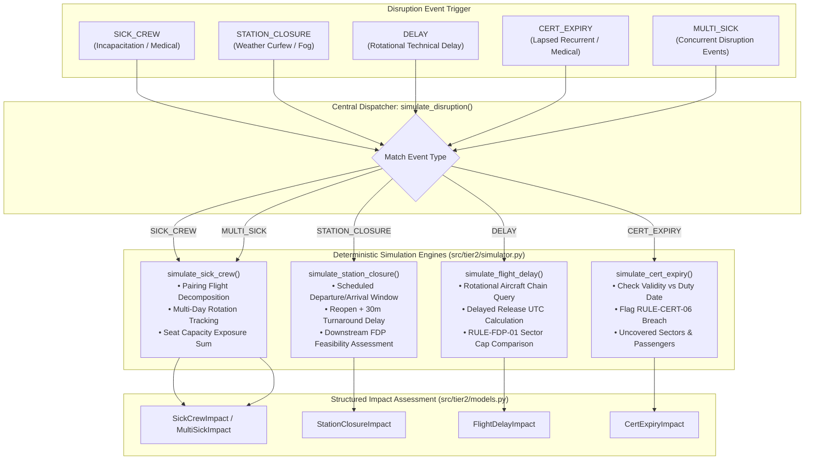
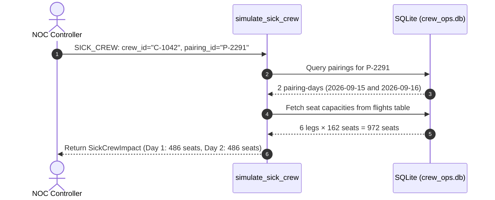

# Tier 2 Disruption Consequence Simulator Architecture & Reference

This document provides a technical explanation of the **Tier 2 Disruption Consequence Simulator** located in [`src/tier2/`](file:///c:/Users/aayus/OneDrive/Desktop/bessemer_dcortex/src/tier2/).

The simulator evaluates operational disruptions in real time: it models cascading flight network impacts, determines uncrewed sectors, calculates passenger seat exposure, projects downstream rotational duty extensions, and checks for compliance violations under **DGCA CAR Section 7, Series J**.

---

## 1. Engine Overview & Disruption Pipeline



---

## 2. Supported Disruption Archetypes

All disruption calculations execute **deterministically in Python directly against SQLite** (`crew_ops.db`), ensuring zero mathematical hallucination.

### A. Sick Crew & Incapacitation (`simulate_sick_crew`)
When a pilot or cabin crew member reports sick:
1. **Pairing Resolution**: Looks up the assigned pairing in `pairings` and `pairing_crew` on or after the reported date.
2. **Multi-Day Rotation Handling**: If the pairing spans multiple calendar days (e.g. Day 1: BLR $\to$ DEL layover, Day 2: DEL $\to$ BOM), it identifies whether the entire rotation or specific days are broken.
3. **Flight Sector Exposure**: Traverses `flights_json` across all broken days, extracting affected flight numbers.
4. **Passenger Seat Exposure**: Sums `seats` from the `flights` table (e.g., 162 seats for A320, 72 seats for ATR72) across all uncovered legs.

- **Scenario S1 (ATR Captain Sick)**: Captain `C-3231` reports sick at 01:30Z for pairing `P-2224` (4 legs on ATR72 `VT-DXE`). Result: 4 uncovered flights (`DX451`, `DX452`, `DX453`, `DX454`) and **288 passenger seats at risk** ($4 \times 72$).
- **Scenario S2 (Flagship Captain Multi-Day Sick)**: Captain `C-1042` reports sick for flagship 2-day pairing `P-2291` on A320 (`VT-DXC`). Result: `is_multi_day = True`, with 3 flights uncovered on Day 1 (486 seats) and 3 flights uncovered on Day 2 (486 seats), totaling **972 passenger seats at risk**.



---

### B. Airport Station Closures & Curfews (`simulate_station_closure`)
Simulates dense fog, monsoon flooding, or runway maintenance at airport stations (e.g. BLR fog closure from 08:00Z to 14:00Z):
1. **Touch Identification**: Queries all departures where `dep_station = station` and `dep_utc` is in window, plus all arrivals where `arr_station = station` and `arr_utc` touches the window.
2. **Reopening + Turnaround**: Calculates the earliest feasible operating time as $\text{reopen\_utc} + 30\text{ minutes}$.
3. **Rotational Delay**: Calculates minimum delay in hours from scheduled time to reopening turnaround.
4. **Crew FDP Feasibility**: Reads the rostered pairing's report time and scheduled sectors to calculate allowable FDP under DGCA `RULE-FDP-01`. If $\text{scheduled\_fdp} + \text{delay\_hours} > \text{fdp\_limit}$, the simulator flags:
   `"delay exceeds crew FDP — re-crew tail legs from reserves or cancel"`.

- **Scenario S3 (BLR Dense Fog Closure)**: Airport closed 08:00–14:00Z on 17 Sep. Identifies 13 affected flight legs touching BLR, assesses individual delay hours, and flags tail legs requiring reserve re-crewing.

---

### C. Rotational Technical Delays (`simulate_flight_delay`)
Models the cascading impact when an aircraft snags or takes an air traffic flow management (ATFM) delay:
1. **Chain Traversal**: Fetches all scheduled flight legs for the aircraft tail on that date in chronological order.
2. **Delayed Release Calculation**: Extends the pairing's scheduled `release_utc` by the delay duration ($\Delta t$).
3. **FDP Cap Evaluation**: Under DGCA `RULE-FDP-01`, allowable FDP decreases with sector count:
   $$\text{FDP Limit} = 13.0\text{h} - 0.5\text{h} \times \max(0, \text{sectors} - 2)$$
   - 4 sectors $\implies 12.0\text{h}$ cap.
   - If $\text{delayed\_release} - \text{scheduled\_report} > \text{FDP Limit}$, the simulator flags an illegal FDP breach, identifying which downstream leg cannot legally be flown by the incumbent crew.

- **Scenario S4 (VT-DXA 90-Minute Delay)**: Scheduled 4-sector duty of 11.25h extended by 1.5h to 12.75h. Exceeds the 12.0h cap by 45 minutes; crew cannot legally operate final sector `DX404`.

---

### D. Lapsed Qualifications & Certifications (`simulate_cert_expiry`)
Verifies pre-flight regulatory compliance under DGCA `RULE-CERT-06`:
1. **Expiry Detection**: Evaluates the crew member's 4 mandatory certificates (`licence`, `medical_class1`, `recurrent_training`, `dangerous_goods`) against the planned duty date.
2. **Assignment Invalidation**: Flags that assigning the crew member violates DGCA regulations and uncovers the pairing legs.

- **Scenario S5 (Mid-Rotation Recurrent Training Expiration)**: First Officer `C-5417` has recurrent training expiring on 17 Sep; flagged as non-compliant for rotation on 19 Sep.

---

### E. Simultaneous Multi-Crew Incapacitations (`simulate_disruption` with `MULTI_SICK`)
Handles complex compounding scenarios where multiple crew call sick concurrently:
1. **Sub-Impact Aggregation**: Evaluates each incapacitation independently.
2. **Leg Deduplication**: Merges uncovered flight lists using unique sets to prevent double-counting flights operated by both affected crew.
3. **Seat Capacity Rollup**: Computes aggregate passenger exposure across all distinct disrupted sectors.

- **Scenario S6 (Dual Incapacitation on VT-DXA & VT-DXB)**: Simultaneous Captain sick calls across two aircraft rotations.

---

## 3. Pydantic Data Models ([`src/tier2/models.py`](file:///c:/Users/aayus/OneDrive/Desktop/bessemer_dcortex/src/tier2/models.py))

```python
class SickCrewImpact(BaseModel):
    disruption_type: Literal["SICK_CREW"] = "SICK_CREW"
    crew_id: str
    pairing_id: str
    reported_utc: str
    role: str
    rank: str
    aircraft_type: str
    is_multi_day: bool = False
    uncovered_flights: list[str] = Field(default_factory=list)
    uncovered_flights_day1: list[str] = Field(default_factory=list)
    uncovered_flights_day2: list[str] = Field(default_factory=list)
    passengers_at_risk: int = 0
    passengers_at_risk_day1: int = 0

class StationClosureImpact(BaseModel):
    disruption_type: Literal["STATION_CLOSURE"] = "STATION_CLOSURE"
    station: str
    window_utc: dict[str, str]
    affected_flights: list[str] = Field(default_factory=list)
    per_flight_assessment: list[dict[str, Any]] = Field(default_factory=list)
    note: str = ""

class FlightDelayImpact(BaseModel):
    disruption_type: Literal["DELAY"] = "DELAY"
    aircraft: str
    date: str
    delay_hours: float
    flight_no: str | None = None
    affected_legs: list[str] = Field(default_factory=list)
    scheduled_fdp: float = 0.0
    fdp_after_delay: float = 0.0
    fdp_limit: float = 12.0
    breach: bool = False
    breach_detail: str = ""
```

---

## 4. Python & REST API Usage

### Python Direct Execution
```python
from src.tier2 import simulate_disruption

# 1. Simulating sick crew
res_sick = simulate_disruption({
    "type": "SICK_CREW",
    "crew_id": "C-3231",
    "pairing_id": "P-2224",
    "reported_utc": "2026-09-16T01:30:00Z",
})
print("Uncovered legs:", res_sick["uncovered_flights"])
print("Passengers at risk:", res_sick["passengers_at_risk"])

# 2. Simulating rotational delay
res_delay = simulate_disruption({
    "type": "DELAY",
    "aircraft": "VT-DXA",
    "date": "2026-09-16",
    "delay_hours": 1.5,
})
print("Breached:", res_delay["breach"])
print("Detail:", res_delay["breach_detail"])
```

### REST API (`POST /api/simulate`)
```bash
# By Scenario ID
curl -X POST http://127.0.0.1:8000/api/simulate \
     -H "Content-Type: application/json" \
     -d '{"scenario_id": "S1"}'

# By Raw Event Payload
curl -X POST http://127.0.0.1:8000/api/simulate \
     -H "Content-Type: application/json" \
     -d '{
       "type": "DELAY",
       "aircraft": "VT-DXA",
       "date": "2026-09-16",
       "delay_hours": 1.5
     }'
```

---

## 5. Automated Verification

The simulator is verified by 11 unit tests in [`tests/test_tier2.py`](file:///c:/Users/aayus/OneDrive/Desktop/bessemer_dcortex/tests/test_tier2.py):

```powershell
.venv\Scripts\pytest.exe tests/test_tier2.py -v
```

### Verified Scenarios:
- `test_scenario_s1_atr_captain_sick`: Validates 4 uncovered legs and 288 seats on ATR72.
- `test_scenario_s2_flagship_captain_sick_multiday`: Validates 2-day breakdown with 486 seats Day 1 / 972 total.
- `test_scenario_s3_blr_station_closure`: Validates BLR 08:00–14:00Z closure, 13 affected flights, and turnaround delays.
- `test_scenario_s4_flight_delay_fdp_breach`: Validates 90m delay on VT-DXA triggering FDP breach.
- `test_scenario_s5_cert_expiry_preflight`: Validates expired recurrent training invalidating assignment.
- `test_scenario_s6_multi_sick`: Validates simultaneous dual Captain incapacitations with seat deduplication.
- `test_generalizability_hyd_closure`: Validates generalizability to HYD station closure.
- `test_held_out_h1_atr_fo_sick`: Validates held-out benchmark scenario H1 (First Officer sick call).
- `test_delay_sensitivity_spectrum`: Validates delay thresholds from 30m (legal) to 120m (breach).
