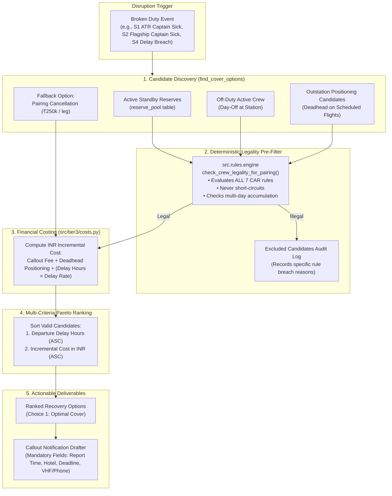

# Tier 3 Recovery Optimizer & Candidate Ranker Architecture & Reference

This document details the **Tier 3 Recovery Optimizer** located in [`src/tier3/`](file:///c:/Users/aayus/OneDrive/Desktop/bessemer_dcortex/src/tier3/).

When operational disruptions strike—crew illness, rotational delays, station curfews, or certificate expiries—the recovery optimizer determines the most cost-effective, operationally feasible, and regulatory-compliant recovery plan under **DGCA CAR Section 7, Series J**.

---

## 1. End-to-End Recovery Optimization Flow



---

## 2. Candidate Discovery & Pool Generation (`find_cover_options`)

The optimizer builds candidate pools across three distinct crew tiers:

1. **Active Standby Reserves (`reserve_pool`)**:
   - Matches crew on published standby at the duty's departure station on the duty date.
   - Verifies the required report time falls within the crew member's published `(on_call_start, on_call_end)` window.
   - Base callout fee: **₹18,500** for pilot, **₹9,500** for cabin crew. Delay: **0.0 hours**.
2. **Off-Duty Day-Off Crew (`crew`)**:
   - Identifies active crew (`status = 'active'`) stationed at the departure base who are not rostered on any pairings on that calendar date.
   - Base callout fee: **₹24,000** for pilot, **₹12,500** for cabin crew. Delay: **0.0 hours**.
3. **Outstation Deadhead Positioning**:
   - If home-base reserves are exhausted, queries scheduled flights arriving at the departure station prior to duty report time.
   - Identifies off-duty crew at outstation hubs who can deadhead.
   - Base fee: Callout fee + **₹6,500** deadhead positioning fee + **(Delay Hours $\times$ ₹5,400/hr)**.
4. **Fallback Option (Pairing Cancellation)**:
   - Evaluates cancelling the uncrewed sectors at **₹250,000 per flight leg** (e.g. 4 cancelled legs $\implies$ ₹1,000,000). Ranked as the last-resort option.

---

## 3. Deterministic CAR Legality Pre-Filter

Unlike naive AI agents that hallucinate crew availability, the Tier 3 optimizer runs every candidate through the **programmatic rules engine** in [`src/rules/engine.py`](file:///c:/Users/aayus/OneDrive/Desktop/bessemer_dcortex/src/rules/engine.py):

```python
legality = check_crew_legality_for_pairing(
    crew_id=cand_id,
    pairing_id=pairing_id,
    conn=c,
    duty_date=p_rows[0]["date"],
    exclude_pairing_ids=[pairing_id],
)
```

### Complete Regulatory Transparency (Excluded Candidates)
Candidates that violate any CAR rule are never silently discarded. They are preserved in the `excluded_candidates` audit log:
- **`C-2087`**: Excluded from covering `P-2291` due to `RULE-DUTY-02`: rolling 7-day duty would reach $61.35\text{h}$, breaching the $60.0\text{h}$ cap by $1\text{h}21\text{m}$.
- **`C-1049`**: Excluded from covering ATR pairing `P-2224` due to `RULE-QUAL-05`: holds `A320` rating only; lacks `ATR72` rating.
- **`C-5837`**: Excluded due to downstream rest conflict: assigning duty today leaves $<12.0\text{h}$ rest before scheduled flight `DX201` tomorrow.

---

## 4. Financial Costing Engine ([`src/tier3/costs.py`](file:///c:/Users/aayus/OneDrive/Desktop/bessemer_dcortex/src/tier3/costs.py))

All financial costs are loaded dynamically from [`data/costs.json`](file:///c:/Users/aayus/OneDrive/Desktop/bessemer_dcortex/data/costs.json). Zero hardcoding:

| Parameter Key | Regulatory / Operational Role | Default Rate (INR) |
|:---|:---|:---|
| `reserve_callout_pilot` | Calling up pilot from standby reserve pool | **₹18,500** |
| `reserve_callout_cabin` | Calling up cabin crew from standby reserve pool | **₹9,500** |
| `dayoff_callout_pilot` | Calling up pilot on scheduled day-off | **₹24,000** |
| `dayoff_callout_cabin` | Calling up cabin crew on scheduled day-off | **₹12,500** |
| `deadhead_positioning` | Passenger ticket cost to position crew member across bases | **₹6,500** |
| `delay_cost_per_duty_hour` | Rotational delay passenger compensation & handling fee | **₹5,400 / hr** |
| `cancellation_per_flight` | Commercial refund & rebooking penalty for cancelled flight leg | **₹250,000 / flight** |
| `hotel_overnight` | Accommodating crew on overnight outstation layover | **₹4,200 / night** |

### Mathematical Formula for Option Cost:
$$\text{Cost} = \text{CalloutFee} + \text{DeadheadPositioning} + \text{round}(\text{DelayHours} \times \text{DelayCostPerHour})$$

---

## 5. Combinatorial Joint Optimization Solver (`solve_joint_optimization`)

In multi-incident scenarios (e.g., Scenario S6 / Question Q32 where Captains call sick on both `VT-DXA` and `VT-DXB` rotations):
- An independent greedy search would assign the single cheapest reserve candidate to the first disruption, leaving the second rotation with an expensive cancellation or deadhead.
- `solve_joint_optimization` performs a **combinatorial matching search**:
  1. Computes candidate pools for Rotation A (`assign_dxa`) and Rotation B (`assign_dxb`).
  2. Enforces mutual exclusion: $\text{crew\_id}_A \ne \text{crew\_id}_B$ (no double-allocation).
  3. Finds the assignment pair $(A^*, B^*)$ that minimizes the global objective:
     $$\min \left( \text{Cost}(A) + \text{Cost}(B) \right)$$

---

## 6. Official Callout Notification Drafter (`generate_callout_notification`)

Validates compliance with airline SOPs and NOC benchmarking (Question Q36). Generates an official callout dispatch alert containing all mandatory operational elements:

```python
from src.tier3 import generate_callout_notification

alert = generate_callout_notification(crew_id="C-3310", pairing_id="P-2291")
print(alert["message_text"])
```

### Generated Dispatch Alert Output:
```text
URGENT CREW DISPATCH CALLOUT — CAPTAIN K. SHARMA (C-3310)
--------------------------------------------------------------------------------
Assignment: Pairing P-2291 (Replacement Cover Duty)
Report Time: 06:00Z, 2026-09-15 @ BLR Crew Room
Day 1 Flights: DX412/DX413/DX588
Overnight Layover: DEL (Hotel accommodation arranged at Radisson Blu Airport Hotel (Crew Wing))
Day 2 Flights: DX589/DX590/DX591 (Report: 04:00Z at DEL)
--------------------------------------------------------------------------------
Mandatory Acknowledgement Deadline: 05:15Z
Operations Desk Contact: Crew Control Desk 2 (+91-80-2800-4412 / VHF 131.85 MHz)
```

---

## 7. Python & REST API Usage

### Python Execution
```python
from src.tier3 import optimize_recovery

# Solve recovery for sick call on P-2291
plan = optimize_recovery({
    "type": "SICK_CREW",
    "crew_id": "C-1042",
    "pairing_id": "P-2291",
    "reported_utc": "2026-09-15T05:00:00Z",
})

print("Recommended Cover:", plan["expected_choice"]["action"])
print("Cost:", plan["expected_choice"]["cost_inr"])
print("Excluded Candidates Count:", len(plan["excluded_candidates"]))
```

### REST API (`POST /api/recover`)
```bash
# 1. By Scenario Identifier
curl -X POST http://127.0.0.1:8000/api/recover \
     -H "Content-Type: application/json" \
     -d '{"scenario_id": "S1"}'

# 2. By Disruption Event
curl -X POST http://127.0.0.1:8000/api/recover \
     -H "Content-Type: application/json" \
     -d '{
       "type": "SICK_CREW",
       "crew_id": "C-1042",
       "pairing_id": "P-2291",
       "reported_utc": "2026-09-15T05:00:00Z"
     }'
```

---

## 8. Automated Verification

The recovery optimizer is verified by 8 comprehensive unit tests in [`tests/test_tier3.py`](file:///c:/Users/aayus/OneDrive/Desktop/bessemer_dcortex/tests/test_tier3.py):

```powershell
.venv\Scripts\pytest.exe tests/test_tier3.py -v
```

### Verified Test Cases:
- `test_scenario_s1_atr_captain_recovery`: Validates S1 recovery choosing reserve `C-3315` at ₹18,500; fallback cancellation at ₹1,000,000.
- `test_scenario_s2_flagship_captain_recovery_multiday`: Validates S2 2-day recovery choosing reserve `C-3310` at ₹18,500; deadhead positioning candidate `C-2210` at ₹41,200 (3.0h delay).
- `test_scenario_s4_delay_fdp_breach_recovery`: Validates recovery options for delayed rotational duty chain.
- `test_scenario_s5_cert_expiry_recovery`: Validates pre-flight replacement for expired certification.
- `test_scenario_s6_joint_multi_sick_optimization`: Validates global combinatorial joint optimization across simultaneous disruptions.
- `test_held_out_h1_first_officer_generalization`: Validates generalization to First Officer recovery.
- `test_senior_cabin_crew_recovery_generalization`: Validates generalization to Senior Cabin Crew recovery.
- `test_callout_notification_generation_q36`: Validates complete adherence to Question Q36 dispatch notification rubric.
